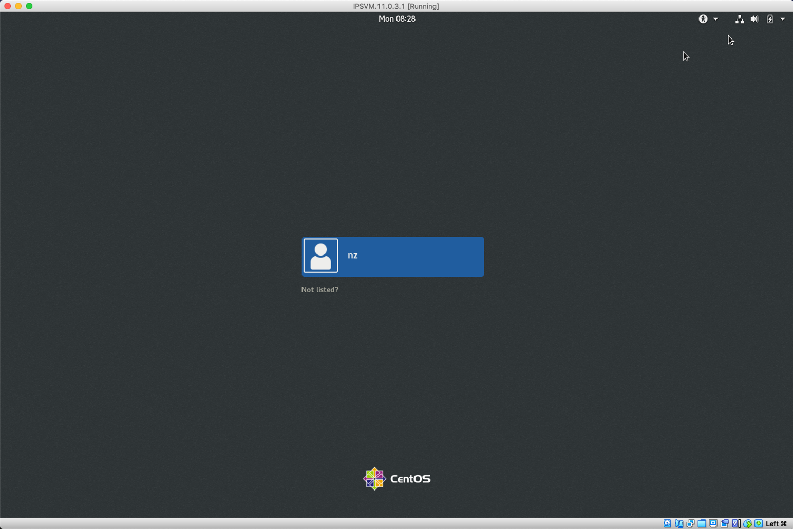

# Command Line Interface

In this lab will explore the IBM Netezza Performance Server command line (CLI).  The CLI will be our primary interface to execute the labs in the workshop.

## NPS and Tricks on Using the Netezza Performance Server Virtual Machines 

The Netezza Performance Server is designed and fine-tuned for specific Cloud Pak for Data System hardware or Netezza Performance Service server on Cloud.  In order to demonstrate the system in a virtualized environment, some adaptations were made on the virtual machines. To ensure the labs run smoothly, we have listed some pointers for using the VMs:  

After pausing the virtual machines, nz services need to be restarted. In the case that the VMs were paused (the host operating system went into sleep or hibernation modes, the images were paused in VMware Workstation,,, etc). To continue using the VMs, run the following commands in the prompt of the Host image. 

!!! abstract "Input"
    ```bash
    nzstop 
    nzstart 	 
    ```
  
## Lab Environment  

The lab system will be a virtual machine running on Virtual Box.  Please see the document on how to install the NPS Virtual Machine for your workstation (Windows or Mac OS).

## Connect to the Netezza Performance Server  

Use the following information on how to connect to the lab system.  There are two options to access the command line:

1. Login to the VM directly and use the terminal application available inside the VM. 
2. Local terminal application on your workstation.

### Login to NPS Command Line using the Virtual Machine GUI

After getting the VM running (see the document on how to install the VM) login as follows:

Login as the `nz` user by clicking in the VM and select the `nz` user:




At the password prompt enter : `nz` and click Sign In


Once you are signed in you can right-click the desktop and select "Open Terminal"


Start NPS if not already started as follows:
!!! abstract "Input"
    ```bash
    nzstate
    nzstart
    nzstate
    ```


You are now ready to proceed to the next section of the lab.

### Login to NPS Command Line for Mac Users

From your Mac OSX system, open the terminal application (or another terminal application like iTerm2).

Open the Terminal.app.

  1. Type command + spacebar.
  2. Type "Terminal.app" in the Spotlight Search window.
  3. Double click "Terminal.app" to launch the Terminal application.


From the Terminal application ssh into the NPS VM with the nz (password:nz) ID and start NPS if not already started.

!!! abstract "Input"
    ```bash
    ssh nz@192.168.9.2
    nzstate
    nzstart
    nzstate
    ```


!!! note "The remainder of the lab will use the command line as the `nz` user."

### Login to NPS Command Line for Windows Users

Start a Windows PowerShell, press the Windows Key and type `powersh` in the Search Bar.  Click "Windows PowerShell"


From the PowerShell application ssh into the NPS VM with the `nz` ID and start NPS if not already started.

!!! abstract "Input"
    ```bash
    ssh nz@192.168.9.2
    nzstate
    ```

If the system is offline:

!!! abstract "Input"
    ```bash
    nzstart
    nzstate
    ```


!!! note "The remainder of the lab will use the command line as the `nz` user."

## Lab Setup

This lab uses an initial setup script to make sure the correct users and databases exist for the remainder of the lab.  Follow the instructions below to run the setup script.

1. Login to NPS Command Line using one of these two methods.

    1. Login to the VM directly and use the terminal application available inside the VM.
    2. Connect to your Netezza Performance Server image using a terminal application (Windows PowerShell, PuTTY, Mac OSX Terminal)

2. If you are continuing from the previous lab and are already connected to nzsql, quit the nzsql console with the `\q` command.

3. Prepare for this lab by running the setup script.  To do this use the following commands:

!!! abstract "Input"
    ```bash
    cd ~/labs/cli/setupLab
    time ./setupLab.sh
    ```

Output similar to the following will be produced.

!!! abstract "Output"
    ```bash
    ERROR:  DROP DATABASE: object LABDB does not exist.
    CREATE DATABASE
    ERROR:  DROP USER: object LABADMIN does not exist.
    CREATE USER
    ALTER USER
    ALTER DATABASE
    CREATE TABLE
    CREATE TABLE
    CREATE TABLE
    CREATE TABLE
    CREATE TABLE
    CREATE TABLE
    CREATE TABLE
    CREATE TABLE
    Load session of table 'NATION' completed successfully
    Load session of table 'REGION' completed successfully
    Load session of table 'CUSTOMER' completed successfully
    Load session of table 'SUPPLIER' completed successfully
    Load session of table 'PART' completed successfully
    Load session of table 'PARTSUPP' completed successfully
    Load session of table 'ORDERS' completed successfully
    Load session of table 'LINEITEM' completed successfully

    real	1m46.490s
    user	0m0.082s
    sys	0m0.784s
    ```

The error message at the beginning is expected since the database `LABDB` and user `LABADMIN` hasn't been created yet.  However, the `DROP` statements are in the setup script in the event the user `LABADMIN` and database `LABDB` exist to start this lab new.

!!! error "Dan - Check this text"
    Note: you downloaded and installed the scripts in the lab: "01-Setup-NPS-Virtual-Machine-Setup-Lab-Guide-Win10-OSX-Final”

This lab is now setup and ready to use for the remainder of the sections.

## Connecting to the System Database

The following section details how to connect to the system database which contains all the system views that describes the database objects.

### Connect to the Netezza System Database Using nzsql

Since we have not created any user and databases yet, we will connect to the default database as the default user, with the following credentials:

* Database: `system` 
* Username: `admin` 
* Password: `password` 
 
When issuing the `nzsql` command, the user supplies the user account, password and the database to connect to using the syntax, below is an example of how this would be done. Do not try to execute that command it is just demonstrating the syntax: 

!!! abstract ""
    ```bash
    nzsql –d [db_name] –u [user] –pw [password] 
    ```
 
Alternatively, these values can be stored in the command shell and passed to the nzsql command when it is issued without any arguments. Let's verify the current database, user and password values stored in the command shell by issuing the `printenv NZ_DATABASE`, `printenv NZ_USER`, and `printenv NZ_PASSWORD` commands. 

!!! abstract "Input"
    ```bash
    printenv NZ_DATABASE
    printenv NZ_USER
    printenv NZ_PASSWORD
    ```

The output should look similar to the following: 

!!! abstract "Output"
    ```bash
    [nz@netezza ~]$ printenv NZ_DATABASE 
    system
    [nz@netezza ~]$ printenv NZ_USER 
    admin
    [nz@netezza ~]$ printenv NZ_PASSWORD 
    password
    ```

Since the current values correspond to our desired values, no modification is required.  

Next, let's take a look at what options are available to start nzsql. Type in the following command:

!!! abstract "Input"
    ```bash
    nzsql -?
    ```

!!! abstract "Output"
    ```bash
    This is nzsql, the IBM Netezza SQL interactive terminal.

    Usage:
      nzsql [options] [security options] [dbname [username] [password]]

    Security Options:
      -securityLevel       Security Level you wish to request (default:    preferredUnSecured)
      -caCertFile          ROOT CA certificate file (default: NULL)

    Options:
      -a                   Echo all input from script
      -A                   Unaligned table output mode (-P format=unaligned)
      -c <query>           Run only single query (or slash command) and exit
      -d <dbname>          Specify database name to connect to (default: SYSTEM)
      -D <dbname>          Specify database name to connect to (default: SYSTEM)
      -schema <schemaname> Specify schema name to connect to (default: $NZ_SCHEMA)
      -e                   Echo queries sent to backend
      -E                   Display queries that internal commands generate
      -f <filename>        Execute queries from file, then exit
      -F <string>          Set field separator (default: "|") (-P fieldsep=)
                           For any binary/control/non-printable character use '$'
                           (e.g., nzsql -F $'\t' // for TAB)
      -host <host>         Specify database server host (default: localhost.   localdomain)
      -h <host>            Specify database server host (default: localhost.   localdomain)
      -H                   HTML table output mode (-P format=html)
      -l                   List available databases, then exit
      -n                   Disable readline
      -o <filename>        Send query output to filename (or |pipe)
      -O <filename>        Send query output with errors to filename (or |pipe)
      -port <port>         Specify database server port (default: hardwired)
      -P var[=arg]         Set printing option 'var' to 'arg' (see \pset command)
      -q                   Run quietly (no messages, only query output)
      -r                   Suppress row count in query output
      -R <string>          Set record separator (default: newline) (-P recordsep=)
      -Rev                 Show version information and exit
      -rev                 Show version information and exit
      -s                   Single step mode (confirm each query)
      -S                   Single line mode (newline terminates query)
      -t                   Print rows only (-P tuples_only)
      -time                Print time taken by queries
      -T text              Set HTML table tag options (width, border) (-P  tableattr=)
      -u <username>        Specify database username (default: admin)
      -U <username>        Specify database username (default: admin)
      -v name=val          Set nzsqlvariable 'name' to 'value'
      -V                   Show version information and exit
      -w                   Don't require password, other mechanisms (Kerberos)     will supply it
      -W <password>        Specify the database user password
      -pw <password>       Specify the database user password
      -x                   Turn on expanded table output (-P expanded)
      -X                   Do not read startup file (~/.nzsqlrc)
      -h or -? or --help   Display this help

    For more information, type "\?" (for internal commands) or "\help"
    (for SQL commands) from within nzsql.
    ```

For more information, type "\?" (for internal commands) or "\help"
(for SQL commands) from within nzsql.
\t```

The `-?` option will list the usage and all options for the `nzsql` command. In this exercise, we will start `nzsql` without arguments. In the command prompt, issue the command: 

!!! abstract "Input"
    ```bash
    nzsql 
    ```
This will bring up the `nzsql` prompt below that shows a connection to the system database as user admin: 

!!! abstract "Output"
    ```bash
    [nz@localhost ~]$ nzsql
    Welcome to nzsql, the IBM Netezza SQL interactive terminal.

    Type:  \h for help with SQL commands
           \? for help on internal slash commands
           \g or terminate with semicolon to execute query
           \q to quit

    SYSTEM.ADMIN(ADMIN)=> 
    ```

### Commonly Used Commands and SQL Statements

There are commonly used commands that start with "\” which we will demonstrate in this section. First, we will run the 2 help commands to familiarize ourselves with these handy commands. The \h command will list the available SQL commands, while the \? command is used to list the internal slash commands. Examine the output for both commands: 

!!! abstract "Input"
    ```bash
    \h 
    \? 
    ```

From the output of the `\?` command, we found the `\l` internal command we can use to find out all the databases.  Let's find out all the databases by entering `\l`: 

!!! abstract "Input"
    ```bash
    \l 
    ```

!!! abstract "Output"
    ```bash
      List of databases
     DATABASE |  OWNER   
    ----------+----------
     LABDB    | LABADMIN
     SYSTEM   | ADMIN
    (10 rows)
    ```

Secondly, we will use `\dSv` to find out the system views within the system database.  Note: there are system tables, however, it isn't recommended to directly access those tables as there can change from release to release and are restricted from the normal user.

Input:

!!! abstract "Input"
    ```bash
    \dSv
    ```

!!! abstract "Output"
    ```bash
                                    List of relations
           Schema       |                 Name                  |    Type     |     Owner
    --------------------+---------------------------------------+-------------  +-------
     DEFINITION_SCHEMA  | _V_ACL_DATA                           | SYSTEM VIEW |     ADMIN
     DEFINITION_SCHEMA  | _V_AGGREGATE                          | SYSTEM VIEW |     ADMIN
     DEFINITION_SCHEMA  | _V_ATTRIBUTE                          | SYSTEM VIEW |     ADMIN
     DEFINITION_SCHEMA  | _V_ATTRIBUTE2                         | SYSTEM VIEW |     ADMIN
     DEFINITION_SCHEMA  | _V_AUTHENTICATION                     | SYSTEM VIEW |     ADMIN
     DEFINITION_SCHEMA  | _V_AUTHENTICATION_SETTINGS            | SYSTEM VIEW |     ADMIN
     DEFINITION_SCHEMA  | _V_BACKUP_GROUP                       | SYSTEM VIEW |     ADMIN
     DEFINITION_SCHEMA  | _V_BACKUP_GROUP_HISTORY               | SYSTEM VIEW |     ADMIN
     DEFINITION_SCHEMA  | _V_BACKUP_GROUP_MEMBER                | SYSTEM VIEW |     ADMIN
     DEFINITION_SCHEMA  | _V_BACKUP_HISTORY                     | SYSTEM VIEW |     ADMIN
     DEFINITION_SCHEMA  | _V_BACKUP_TABLE_HISTORY               | SYSTEM VIEW |     ADMIN
     DEFINITION_SCHEMA  | _V_BLOWER                             | SYSTEM VIEW |     ADMIN
     DEFINITION_SCHEMA  | _V_BNR_CONNECTOR                      | SYSTEM VIEW |     ADMIN
     DEFINITION_SCHEMA  | _V_CLASS                              | SYSTEM VIEW |     ADMIN
     DEFINITION_SCHEMA  | _V_CLASS2                             | SYSTEM VIEW |     ADMIN
     DEFINITION_SCHEMA  | _V_CLIENT_COMPATIBILITY               | SYSTEM VIEW |     ADMIN
     DEFINITION_SCHEMA  | _V_CONNECTION                         | SYSTEM VIEW |     ADMIN
    
    --More—
    ```

Note: press the space bar to scroll down the result set when you see `--More--` on the screen.

The list of the system views was truncated in the output above due to the length.  Here are the primary views to investigate for DBAs/users new to Netezza:

!!! abstract "Output"
    ```bash
    _V_GROUP
    _V_USER
    _V_SESSION_V_DATABASE
    _V_SCHEMA
    _V_TABLE
    _V_VIEW
    _V_ATTRIBUTE
    _V_SEQUENCE
    _V_SYNONYM
    _V_FUNCTION
    _V_AGGREGATE
    _V_PROCEDURE
    ```

From the previous command, we can see that there is a user table called `_V_USER`. To find out what is stored in that table, we will use the describe command \d: 

!!! abstract "Input"
    ```bash
    \d _V_USER 
    ```

!!! abstract "Output"
    ```bash
                                View "_V_USER"
          Attribute      |          Type          | Modifier | Default Value
    ---------------------+------------------------+----------+---------------
     OBJID               | OID                    | NOT NULL |
     USERNAME            | NAME                   | NOT NULL |
     OWNER               | NAME                   |          |
     VALIDUNTIL          | TIMESTAMP              |          |
     CREATEDATE          | ABSTIME                | NOT NULL |
     ROWLIMIT            | INTEGER                |          |
     ACCT_LOCKED         | BOOLEAN                |          |
     INV_CONN_CNT        | SMALLINT               |          |
     PWD_INVALID         | BOOLEAN                |          |
     PWD_LAST_CHGED      | DATE                   |          |
     SESSIONTIMEOUT      | INTEGER                |          |
     QUERYTIMEOUT        | INTEGER                |          |
     DEF_PRIORITY        | NAME                   |          |
     MAX_PRIORITY        | NAME                   |          |
     USESYSID            | INTEGER                |          |
     OBJDELIM            | BOOLEAN                | NOT NULL |
     USERESOURCEGRPID    | OID                    |          |
     USERESOURCEGRPNAME  | NAME                   |          |
     CROSS_JOINS_ALLOWED | CHARACTER VARYING(255) |          |
     USEAUTH             | CHARACTER VARYING(255) |          |
     PWD_EXPIRY          | INTEGER                |          |
    View definition: SELECT O.OBJID, O.OBJNAME AS USERNAME, O."OWNER", U.VALUNTIL   AS VALIDUNTIL, O.CREATEDATE, U.USERESULTLIMIT AS ROWLIMIT, U.USELOCKED AS     ACCT_LOCKED, U.USEINVCONNCNT AS INV_CONN_CNT, U.USEPWDINV AS PWD_INVALID, U.    USEPWDCHGED AS PWD_LAST_CHGED, U.USESESSTIMELIMIT AS "SESSIONTIMEOUT", U.   USEQRYDURATION AS "QUERYTIMEOUT", DP.PRILITERAL AS DEF_PRIORITY, MP.PRILITERAL     AS MAX_PRIORITY, U.USESYSID, O.OBJDELIM, U.USERESOURCEGRP AS USERESOURCEGRPID,  CASE WHEN (O.OBJID = 4900) THEN "NAME"(('_ADMIN_'::"NVARCHAR")::NVARCHAR(255))   WHEN ((U.USERESOURCEGRP ISNULL) OR (U.USERESOURCEGRP = 4901)) THEN "NAME" (('PUBLIC'::"NVARCHAR")::NVARCHAR(255)) ELSE G.OBJNAME END AS    USERESOURCEGRPNAME, CASE WHEN (U.USECROSSJOIN ISNULL) THEN ('NULL'::"VARCHAR") ::VARCHAR(255) WHEN (U.USECROSSJOIN = 0) THEN ('NULL'::"VARCHAR")::VARCHAR(255)  WHEN (U.USECROSSJOIN = 1) THEN ('FALSE'::"VARCHAR")::VARCHAR(255) ELSE   ('TRUE'::"VARCHAR")::VARCHAR(255) END AS CROSS_JOINS_ALLOWED, CASE WHEN (U.   USEAUTH = 1) THEN ('LOCAL'::"VARCHAR")::VARCHAR(255) ELSE ('DEFAULT'::"VARCHAR")   ::VARCHAR(255) END AS USEAUTH, U.USEPASSWDEXPIRY AS PWD_EXPIRY FROM    ((((DEFINITION_SCHEMA."_V_OBJ_USER" O JOIN DEFINITION_SCHEMA."_T_USER" U ON ((O.   OBJID = U.OID))) LEFT JOIN DEFINITION_SCHEMA."_T_PRIORITY" DP ON ((U.  USEDEFPRIORITY = DP.PRICODE))) LEFT JOIN DEFINITION_SCHEMA."_T_PRIORITY" MP ON    ((U.USEMAXPRIORITY = MP.PRICODE))) LEFT JOIN DEFINITION_SCHEMA."_V_OBJ_GROUP" G    ON ((U.USERESOURCEGRP = G.OBJID)));
    ```

This will return all the columns of the `_V_USER` system table. Next, we want to know the existing users stored in the table. In case too many rows are returned at once, we will first calculate the number of rows it contains by enter the following query: 

!!! abstract "Input"
    ```bash
    SELECT COUNT(*) FROM (SELECT * FROM _V_USER) AS "Wrapper"; 
    ```

!!! abstract "Output"
    ```bash
    COUNT
    -------
         2
    (1 row)
    ```

The query above is essentially the same as `SELECT COUNT (*) FROM _V_USER`, we have demonstrated the sub-select syntax in case there is a complex query that needed to have the result set evaluated. The result should show there is currently 2 entries in the user table. We can enter the following query to list the user names: 

!!! abstract "Input"
    ```bash
    select objid, username, owner, createdate, useauth, pwd_expiry from _v_user;
    ```

!!! abstract "Output"
    ```bash
     OBJID  | USERNAME | OWNER |     CREATEDATE      | USEAUTH | PWD_EXPIRY
    --------+----------+-------+---------------------+---------+------------
       4900 | ADMIN    | ADMIN | 2020-01-24 08:26:22 | DEFAULT |          0
     210500 | LABADMIN | ADMIN | 2020-05-11 07:58:31 | DEFAULT |          0
    ```

### Exit nzsql

To exit nzsql, use the command \q to return to the Netezza Performance Server system.  
!!! abstract "Input"
    ```bash
    \q
    ```

## `nzsql` Command

The nzsql command invokes a SQL command interpreter on the IBM® Netezza® host or on an IBM Netezza client system. You can use this SQL command interpreter to create database objects, run queries, and manage the database.

To run the nzsql command, enter:
!!! abstract "Input"
    ```bash
    nzsql [options] [security options] [dbname [user] [password]]
    ```

The following table describes the `nzsql` command parameters. 


You will be using the `nzsql` command line tool throughout the labs.