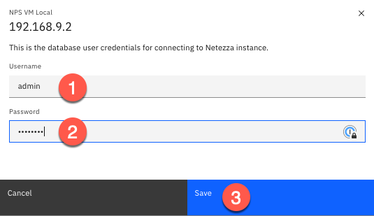
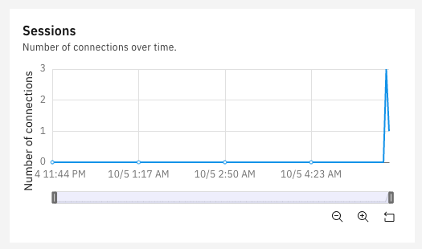
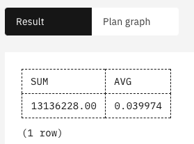
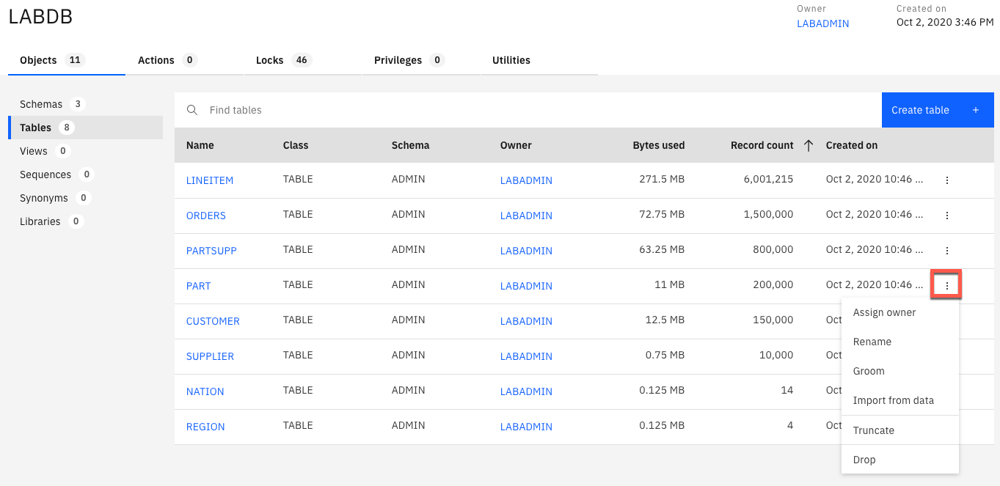
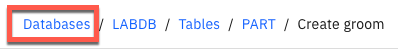
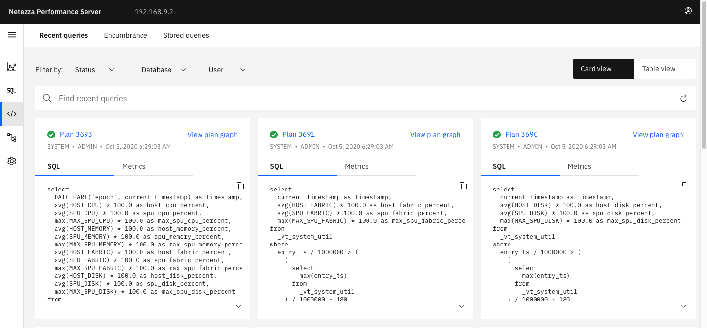

# 1 Web Console

In this lab we will explore the features of the IBM Netezza Performance
Server console. The console is a HTML-based application that allows
users to manage the system, obtain hardware information and status, and
manage various aspects of user databases, tables, and objects.

The VMWare image we are using in the labs differs significantly from a
normal Netezza Performance Server. Each Netezza Performance Server has
the Web Console running as an OpenShift containerized application on the
control plane/master nodes. In this environment, the Web Console is
running natively on the `NPSVB` virtual machine.

# 2 Lab Setup

This lab uses an initial setup script to make sure the correct users and
database exist for the remainder of the lab. Follow the instructions
below to run the setup script.

1.  Login to NPS Command Line using one of these two methods.

    1.  Login to the VM directly and use the terminal application
        available inside the VM.

    2.  Connect to your Netezza Performance Server image using a
        terminal command, for example PuTTY (Windows) or Terminal (Mac).

See the Setup Lab for more details on accessing the Linux command
line.

2.  If you are continuing from the previous lab and are already
    connected to `nzsql` quit the console with the `\q` command.

3.  Prepare for this lab by running the setup script. To do this use the
    following commands:

!!! abstract "Input"
    ```
    cd ~/labs/console/setupLab/
    ./setupLab.sh
    ```

!!! success "Output"
    ```
    DROP DATABASE
    CREATE DATABASE
    ERROR: CREATE USER: object LABADMIN does not exist.
    ALTER USER
    ALTER DATABASE
    CREATE TABLE
    CREATE TABLE
    CREATE TABLE
    CREATE TABLE
    CREATE TABLE
    CREATE TABLE
    CREATE TABLE
    CREATE TABLE
    Load session of table 'NATION' completed successfully
    Load session of table 'REGION' completed successfully
    Load session of table 'CUSTOMER' completed successfully
    Load session of table 'SUPPLIER' completed successfully
    Load session of table 'PART' completed successfully
    Load session of table 'PARTSUPP' completed successfully
    Load session of table 'ORDERS' completed successfully
    Load session of table 'LINEITEM' completed successfully
    ```

While the setup script is running proceed to the next step.

## 2.1 Starting NPS Web Console

After booting up the `NPSVB` virtual machine with Virtual Box follow these
steps to start the Web Console application inside the VM:

-   Open a terminal application from the VM Desktop or remotely with
    PuTTY (Windows) or Terminal (Mac).

    -   **VM Desktop**: open a “Terminal”, right click Desktop and
        select “Open Terminal”


-   **VM Desktop**: switch to the `root` user
!!! abstract ""
    ```
    su –
    password: netezza
    ```

-   Remotely via ssh 
!!! abstract ""
    ```
    ssh root@192.168.9.2
    password: netezza
    ```

-   Start the service pods
!!! abstract ""
    ```
    start-cyclops.sh
    ```

-   Check that the two pods are running
!!! abstract ""
    ```
    docker ps
    ```


!!! note "To stop the console, run the following command for each container"
    ```
    docker stop <container-id>
    ```

## 2.2 Launch the NPS Console

If you already configured the access to the NPS in the Setup Lab, you
can skip this chapter.

Open a browser on your host machine or from the virtual machine, use
`https://192.168.9.2:8443` as URL.


Add an the local NPS instance

* **Click Add instance**

Enter the following information:

* Name: `NPS VM Local`
* Host: `192.168.9.2`
* Port: `5480`
* Admin Username: `admin`
* Admin Password: `password`

Click **Save**.

!!! note "If you see the following error on the top right of your browser then Netezza is not active"


Go to the VM Linux command line and run `nzstart` as the `nz` user.


Click the three vertical ellipes to right of the newly created
instance and select **Add credentials**.


Note: There are four available options:

* Add credentials
* Edit
* Rename
* Remove

Enter the following values (admin is the default superuser for NPS)

* Username: `admin`
* Password: `password`

Click: **Save**



!!! note "This is a database user defined inside of NPS by the create user SQL statement."

`admin` is the default superuser for NPS.

The instance should now have a hot link for the host URL.


You can select the three vertical ellipses to reveal the following
options:

* Add DB user credential
* Edit system credential
* Rename
* Remove

**Click** on the Host URL to gain access to the NPS Console for Instance: **NPS VM Local.**


1.  **Navigation** **menu** to expose all menu options.

2.  **Dashboard** – the default view, shows the over system usage over
    different or custom time horizons (1 hour, 6 hours, 12 hours, 24
    hours, 3 days, Custom).

3.  **Query Editor** – Run/review SQL statements of the active Netezza
    instance, display results and optional display plan graph.

4.  **Queries** – Recent queries, Encumbrance or Stored Queries

5.  **Data** – manage database objects

6.  **Administration** – User Management, Recovery events, Event rules,
    Schedulre rules, History Configuration

7.  **Resource consumption** – system resources: Memory, Compute,
    Storage, Fabric

8.  **Query throughput** – Number of queries completed over time

9.  **Query performance** – Average query performance over time

10. **Sessions** – number of sessions connections over time

11. **Query runtime distribution** – number of queries run for a given
    time range: 0-2 seconds, 2 second – 1 minute, 1 – 5 minutes, 10 – 30
    minutes, 30 minutes – 1 hour, 1 hour – 5 hours, &gt; 5 hours

12. **Real time resource usage** – Storage, Compute Memory, Memory

13. **Running Queries** – Long running query, recent queries

!!! success "Congratulations you now have access to the NPS Console running inside the NPS VM."

# 3 Troubleshooting the Web Console

If you receive this error when attempting to access the NPS Console:
“This site can’t be reached” follow these steps to resolve the issue.

**Stop active containers:**
!!! abstract ""
    ```
    docker ps
    ```

Take note of the container IDs.

**Stop active containers:**
!!! abstract ""
    ```
    docker stop <container-ID>
    ```

**Remove the inactive containers:**
!!! abstract ""
    ```
    docker ps -a
    ```

Take note of the container IDs.

**Stop active containers:**
!!! abstract ""
    ```
    docker rm <container-ID>
    ```

**Reinstall NPS Console:**
!!! abstract ""
    ```
    /root/cyclops\_dockerrun/standalone-install.sh
    ```

# 4 Monitor System Performance

At this point you should be connected to the NPS console. The main
screen after logging on displays information on the system usage and
throughput. In the main screen you will be able to monitor some of the
key performance metrics:

* System utilization
* Throughput
* Average query performance
* Number of active queries


Scroll down to retrieve information on active sessions in the system:



Use the slider below the "Query throughput" tile to display information
for the last two hours:


Notice how the displayed information changes:


Click this icon to open the Query editor menu option under the
Navigation menu. (Top Left)


This allows you to execute queries against a database. You can store the
queries as well. In addition to the result of the query you can also
look at the explain plan.

Let’s create a query called **testquery** (1) against database `LABDB` (2)
and schema `ADMIN` (3).

Enter the following SQL statement (4) and click **Run** (5) to execute
the query.

!!! abstract "Input:"
    ```
    SELECT SUM(L_QUANTITY), AVG(L_TAX) FROM LINEITEM WHERE EXTRACT(MONTH
    FROM L_SHIPDATE) = 4
    ```


Note: Typically you terminate the SQL statement with a semicolon (`;`). In
	this example omit the semicolon (reason: issue with Plan Graph when
	using a semicolon, next step). The result is displayed on the right side
	of the page:



Clicking **Plan graph** tab to displays information on the access
methods used for this statement:


You can access the different parts of the console through the
"Navigation" menu in the upper left corner. 


# 5 Retrieve Information on NPS Configuration

From the Navigation menu select “Dashboard”. Select the Hardware tab to
access the hardware monitoring portion of the NPS console.

The Overview tab displays:

-   Summary
    -   System state
    -   Authentication
    -   Version
    -   Spare disks
-   SPUs (Snippet Processing Units)
    -   Total
    -   Online
    -   Active

!!! note "This is a Netezza Performance Server VM which only has 1 SPU. A typical Netezza Performance Server will have many SPUs."

-   System disk status
    -   Total disk space
    -   Used
    -   Free
    -   Data slices over 90% disk space
-   Storage utilization
    -   Minimum
    -   Average
    -   Maximum

Click **SPU units** to retrieve information on the SPUs defined in the
VM.


The one data slices in your system can displayed as well: Click **Data
Slices**


# 6 Manage Databases

Click the Navigation menu and select the click **Data** to access the
Databases screen of the NPS console. The following screen opens:


You see that the two databases in the system are displayed: The
**SYSTEM** database and the **LABDB** database that you created earlier.

Click **LABDB**. An overview of the database object is displayed. In
total, this database has 11 objects: three schemas and eight tables.


Click  to open the overview of the database tables.


Use the sort option of the view to find the table with the most rows,
click **Record count** header.


As you can see, table `LINEITEM` has over 6 million rows.

For the **PART** table select the Kebab (three dots) to the right. This
allows you to run several operations against the table, like `RENAME` or
`GROOM`.



Click **Groom**. A new screen opens that allows you define the mode to
be used by `GROOM` and if a reclaim backup set should be used.


Do not start the `GROOM`, but instead go back to the main page of the
database menu by clicking Databases from the breadcrumbs.



Click **Create database** to open a new pane that allows you create a
new database.

Create a new database **TESTDB**. Enter **TESTDB** (1) in the name field
and click **Create** (2)**.**


The console opens a new pane, with information on the database objects
in the newly created database `TESTDB`.


Go to the **Tables** view of this screen.


Click **Create table** to add a new table. Choose **ADMIN** (1) as the
schema and **TESTTABLE** (2) as the table name. Click Create + (3) in
the columns section to add a column called **C1** (4) of type `BIGINT`.
Enter a second column called **D1** (5) as type **DATE**. Select **C1**
(6) as the distribution column.


The console shows you the DDL statement that will be used to create the
table:

Click **Create** (7) to create the table.


In the next screen, go back to the database overview: Click
**Databases**


You can easily administer databases in the console. Let’s delete the new
database **TESTDB** now. Move your mouse to the end of the line for the
database **TESTDB**. Click the Kebab menu (1) for the **TESTDB**
database and select **Drop**. (2)


Confirm the action in the pop-up menu, click **Drop**.


Back in the database screen, you see only the two original databases.

# 7 Queries

In the Navigation menu of the console go to **Queries** **&rarr; Recent
queries**.


This opens a screen with information on the last queries that were
executed in NPS.



On the left side of the screen, you can filter the result set. Filter to
all by Status (Running, Success)**, Database, User.**

Select the following filters: Status: Success, Database: `LABDB` and User:
ADMIN


The result set is automatically filtered.

Select the Metrics tab for one of the queries to receive more details
about a successful query.


Select a **Plan ID** for one the queries.


You are now on the query editor for the selected plan. You can run the
query and/or get a Plan graph.

# 8 Explore

There are many other options available from the Console, please use this
time to explore. You can connect to the NPS on Cloud instance previously
added to the instance list to monitor a simulated workload and explore
the history database.

-   Administration
    -   User/Group Management
    -   Recovery events
    -   Event rules
    -   Scheduler rules
    -   History configuration

!!! success "Congratulations on finishing the chapter!"
	Congratulations on finishing the chapter on the NZ Web Console.