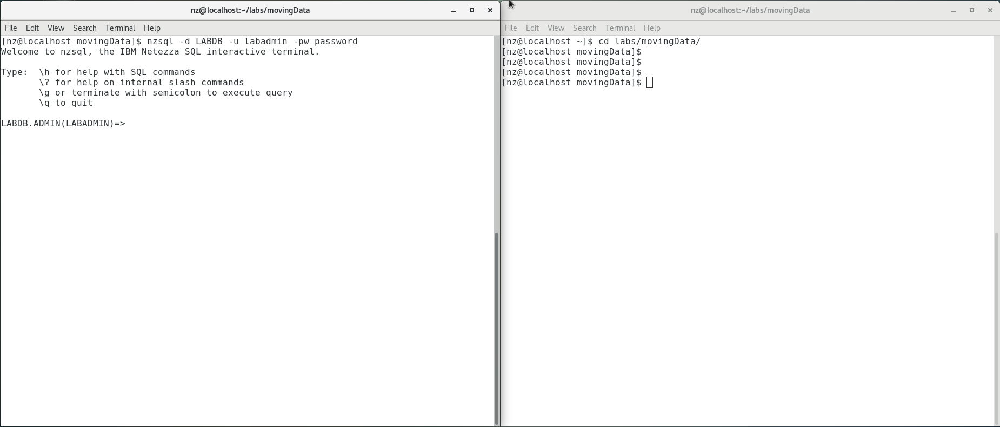

# 1 Load and Unloading Data

In every data warehouse environment, there is a need to load new data
into the database. The task to load data into the database is not just a
one-time operation but rather a continuous operation that can occur
hourly, daily, weekly, or even monthly. Loading data into the database
is a vital operation that needs to be supported by the data warehouse
system. Netezza Performance Server (NPS) provides a framework to support
not only the loading of data into the Netezza Performance Server
database environment, but also the unloading of data from the database
environment. This framework contains more than one component, some of
these components are:

External Tables - These are tables stored as flat files on the host or
client systems and registered like tables in the Netezza Performance
Server catalog. They can be used to load data into the Netezza
Performance Server or unload data to the file system.

`nzload` - This is a wrapper command line tool around external tables
that provides an easy method loading data into the Netezza Performance
Server.

Format Options - These are options for formatting the data load to and
from external tables.

## 1.1 Objectives

This lab will help you explore the Netezza Performance Server framework
components for loading data into the database and unloading data from
the database. You will use the various commands to create external
tables to unload and load data. You will also get a basic understanding
of the nzload utility. In this lab the REGION and NATION tables in the
LABDB database are used to illustrate the use of external tables and the
nzload utility. After this lab you will have a good understanding on how
to load and unload data from a Netezza Performance Server database
environment

The first part of this lab will explore using External Tables to unload
and load data.

The second part of this lab will discuss using the nzload utility to
load records into tables.

## 2 Lab Environment

The lab system will be a virtual machine running on Virtual Box. Please
see the document on how to install the NPS Virtual Machine for your
workstation (Windows or Mac OS).

## 3 Connect to the Netezza Performance Server

Use the following information to connect to the virtual NPS system.
There are two options to access the command line:

1.  Login to the VM directly and use the terminal application available
    inside the VM.

2.  Use the local terminal application on your workstation.

The lab will use the command line as the nz user.

## 4 Lab Setup

This lab uses an initial setup script to make sure the correct user and
database exist for the remainder of the lab. Follow the instructions
below to run the setup script.

1.  Login to NPS Command Line using one of these two methods.

    a.  Login to the VM directly and use the terminal application
        available inside the VM.

    b.  Connect to your Netezza Performance Server image using a
        terminal application (Windows PowerShell, PuTTY, Mac OSX
        Terminal)

2.  If you are continuing from the previous lab and are already
    connected to `nzsql` quit the `nzsql` console with the `\q` command.

3.  Prepare for this lab by running the setup script. To do this use the
    following two commands:

=== "Input"
	```
	cd ~/labs/movingData/setupLab
	./setupLab.sh
	```

=== "Output"
	```
	DROP DATABASE
	CREATE DATABASE
	ERROR: CREATE USER: object LABADMIN already exists as a USER.
	ALTER USER
	ALTER DATABASE
	CREATE TABLE
	CREATE TABLE
	CREATE TABLE
	CREATE TABLE
	CREATE TABLE
	CREATE TABLE
	CREATE TABLE
	CREATE TABLE
	Load session of table 'NATION' completed successfully
	Load session of table 'REGION' completed successfully
	Load session of table 'CUSTOMER' completed successfully
	Load session of table 'SUPPLIER' completed successfully
	Load session of table 'PART' completed successfully
	```

The error message at the beginning is expected since the script tries
to clean up existing LINEITEM tables.

## 5 External Tables

An external table allows Netezza Performance Server to treat an external
file as a database table. An external table has a definition, a table
schema, in the Netezza Performance Server system catalog, but the actual
data exists outside of the Netezza Performance Server database. This is
referred to as a data source file. External tables can be used to access
files which are stored on a file system. After you have created the
external table definition, you can use `INSERT INTO` statements to load
data from the external file into a database table or `SELECT FROM`
statements to query the external table. Different methods are described
to create and use external tables using the nzsql interface. The
external data source files for the external tables will also be
examined, so a second session will be used to view these files.

Connect to your Netezza Performance Server image using a Terminal
application to ssh into `<your-nps-vm-ip-address>` (as `user nz` with
password `nz`). Alternatively, you can use a terminal application on the
virtual machine desktop.

`<your-nps-vm-ip-address>` is the default IP address for a local VM, the
IP may be different for your session.

Change to the lab working directory `/home/nz/labs/movingData` using the
following command:

=== "Input"
	```	
	cd /home/nz/labs/movingData
	```
	
Connect to the `LABDB` database as the database owner, `LABADMIN`, using the
`nzsql` interface:

=== "Input"
	```	
	nzsql -d LABDB -u labadmin -pw password
	```

=== "Output"
	```
	Welcome to nzsql, the IBM Netezza SQL interactive terminal.
	
	Type: \h for help with SQL commands
	\? for help on internal slash commands
	\g or terminate with semicolon to execute query
	\q to quit
	```
	
In this lab we will need to alternatively execute SQL commands and
operating system commands. To make this task easier for you, we will
open a second Terminal session for executing operating system commands
like nzload, view generated external files etc. It will be referred to
as session 2 throughout the lab.



The picture above shows the two Terminal windows that you will need.
Terminal 1, on the left, will be used for SQL commands and Terminal 2,
on the right, will be used for operating system prompt commands.

Open another session `[Terminal 2]` using PuTTY or a Terminal
Application.

Login to `<your-nps-vm-ip-address>` as user `nz` with password `nz`.

Change to the `/home/nz/labs/movingData` directory:

=== "Input [Terminal 2]"
	```
	cd /home/nz/labs/movingData
	```
	
### 5.1 Unloading Data using External Tables

External tables will be used to unload rows from the LABDB database as
records into an external datasource file. Various methods to create and
use external tables will be explored unloading rows from either `REGION`
or `NATION` tables. Five different basic use cases are presented for you
to follow so you can gain a better understanding of how to use external
tables to unload data from a database.

#### 5.1.1 Unloading data with an External Table created with the SAMEAS clause 

The first external table will be used to unload data from the `REGION`
table into an ASCII delimited text file. This external table will be
named `ET1_REGION` using the same column definition as the `REGION` table.
After the `ET1_REGION` external table is created you will then use it to
unload all the rows from the `REGION` table. The records for the
`ET1_REGION` external table will be in the external datasource file,
et1_region_flat_file. The basic syntax to create this type of external
table is:

**Sample Syntax**
```
CREATE EXTERNAL TABLE table_name
SAMEAS table_name
USING external_table_options
```

The `SAMEAS` clause allows the external table to be created with the same
column definition of the referenced table. This is referred to as
implicit schema definition.

As the `LABDB` database owner, `LABADMIN`, you will create the first basic
external table using the same column definitions as the `REGION` table:

=== "Input [Terminal 1]"
	```
	create external table et1_region sameas region using
	(dataobject  ('/home/nz/labs/movingData/et1_region_flat_file'));
	```

=== "Output"
	```
	CREATE EXTERNAL TABLE
	```

Use the internal slash option `\dx` to list the external tables in the
LABDB database.

=== "Input [Terminal 1]"
	```
	\dx
	```

=== "Output"
	```
	             List of relations
	 Schema |    Name    |      Type      |  Owner   
	--------+------------+----------------+----------
	 ADMIN  | ET1_REGION | EXTERNAL TABLE | LABADMIN
	(1 row)
	
	```

List the properties of the external table et1_region using the following
internal slash option to describe the table, `\d <external table
name>`.

=== "Input [Terminal 1]"
	```
	\d et1_region
	```

=== "Output"
	```
	        External Table "ET1_REGION"
	  Attribute  |          Type          | Modifier 
	-------------+------------------------+----------
	 R_REGIONKEY | INTEGER                | NOT NULL
	 R_NAME      | CHARACTER(25)          | NOT NULL
	 R_COMMENT   | CHARACTER VARYING(152) | 
	
	DataObject - '/home/nz/labs/movingData/et1_region_flat_file'
	
	adjustdistzeroint   - 
	bool style          - 1_0
	code set            - 
	compress            - FALSE
	cr in string        - 
	ctrl chars          - 
	date delim          - -
	date style          - YMD
	delim               - |
	encoding            - INTERNAL
	escape              - 
	fill record         - 
	format              - TEXT
	ignore zero         - 
	log dir             - /tmp
	max errors          - 1
	max rows            - 
	null value          - NULL
	quoted value        - NO
	remote source       - 
	require quotes      - 
	skip rows           - 
	socket buf size     - 8388608
	timedelim           - :
	time round nanos    - 
	time style          - 24HOUR
	trunc string        - 
	y2base              - 
	includezeroseconds  - 
	record length       - 
	record delimiter    - 
	
	nullindicator bytes - 
	layout              - 
	decimaldelim        - 
	disablenfc          - 
	includeheader       - 
	datetime delim      -  
	meridian delim      -  
	lfinstring          -
	```

This output includes the columns and associated data types in the
external table. Notice that this is similar to the `REGION` table since
the external table was created using the `SAMEAS` clause in the `CREATE
EXTERNAL TABLE` command. The output also includes the properties of the
external table. The most notable property is the `DataObject` property
that shows the location and the name of the external datasource file
used for the external table. We will examine some of the others.

Now that the external table is created, use it to unload data from the
`REGION` table using an `INSERT` statement.

=== "Input [Terminal 1]"
	```
	insert into et1_region select * from region;
	```

=== "Output"
	```
	INSERT 0 4
	```
Use the external table like a regular table by issuing SQL statements.
Try issuing a simple `SELECT FROM` statement to return all rows in
external table `ET1_REGION` :

=== "Input [Terminal 1]"
	```
	select * from et1_region order by 1;
	```

=== "Output"
	```
     R_REGIONKEY |          R_NAME           |          R_COMMENT          
	-------------+---------------------------+-----------------------------
	           1 | na                        | north america
	           2 | sa                        | south america
	           3 | emea                      | europe, middle east, africa
	           4 | ap                        | asia pacific
	(4 rows)
	```

You will notice that this is the same data that is in the `REGION` table.
But the data retrieved for this `SELECT` statement was from the datasource
of this external table and not from the data within the database.

The main reason for creating an external table is to unload data from a
table to a file. Using the second Putty (or Terminal) session, review
the file `et1_region_flat_file`. This is the file that was created in the
`/home/nz/labs/movingData` directory.

=== "Input [Terminal 2]"
	```
	more et1_region_flat_file
	```

=== "Output"
	```
	3|emea|europe, middle east, africa
	1|na|north america
	2|sa|south america
	4|ap|asia pacific
	```
	
This is an ASCII delimited flat file containing the data from the `REGION`
table. The column delimiter used in this file was the default character
'`|`'.

#### 5.1.2 Unloading data with an External Table using the AS SELECT clause

The second external table will be used to unload data from the `REGION`
table into an ASCII delimited text file using a different method. The
external table will be created and the data will be unloaded in the same
create statement. A separate step is not required to unload the data.
The external table will be named `ET2_REGION` and the external datasource
file will be named `et2_region_flat_file`. The basic syntax to create this
type of external table is:

**Sample Syntax**
```
CREATE EXTERNAL TABLE table_name 'filename' AS select_statement;
```

The `AS` clause allows the external table to be created with the same
columns returned in the `SELECT FROM` statement, which is referred to as
implicit table schema definition. This also unloads the rows at the same
time the external table is created.

The first method used to create an external table required the data to
be unloaded in a second step using an `INSERT` statement. Using the first
Putty (or Terminal) session, create an external table and unload the
data in a single step.

=== "Input [Terminal 1]"
	```
	create external table et2_region
	'/home/nz/labs/movingData/et2_region_flat_file' as select * from region;
	```

=== "Output"
	```
	INSERT 0 4
	```

This command created the external table `ET2_REGION` using the same
definition as the `REGION` table and also unloaded the data to the
et2_region_flat_file.

Again, use `\dx` to list the external tables in the `LABDB` database.

=== "Input [Terminal 1]"
	```
	\dx
	```

=== "Output"
	```
	                List of relations
	 Schema |    Name    |      Type      |  Owner   
	--------+------------+----------------+----------
	 ADMIN  | ET1_REGION | EXTERNAL TABLE | LABADMIN
	 ADMIN  | ET2_REGION | EXTERNAL TABLE | LABADMIN
	(2 rows)
	
	```

You will notice that there are now two external tables. You can also
list the properties of the external table. The output will be similar to
the output in the last section, except for the filename.

Using the second session, review the file that was created,
`et2_region_flat_file`, in the `/home/nz/labs/movingData directory`.

=== "Input [Terminal 2]"
	```
	more et2_region_flat_file
	```

=== "Output"
	```
	3|emea|europe, middle east, africa
	1|na|north america
	2|sa|south america
	4|ap|asia pacific
	```
	
This file is exactly the same as the file you reviewed in the last
chapter. The only difference in this example is we didn't need to unload
it explicitly.

#### 5.1.3 Unloading data with an external table using defined columns

The first two external tables that you created used the exact same
columns from the `REGION` table using an implicit table schema. You can
also create an external table by explicitly specifying the columns. This
is referred to as an explicit table schema. The third external table
that you create will still be used to unload data from the `REGION` table
but only from the `R_NAME` and `R_COMMENT` columns. The `ET3_REGION` external
table will be created in one step and then the data will be unloaded
into the `et3_region_flat_file ASCII` delimited text file using a
different delimiter string. The basic syntax to create this type of
external table is:

**Sample Syntax**
```
CREATE EXTERNAL TABLE table_name ({column_name type} [, ... ])
[USING external_table_options}]
```

1.  Create a new external table to only include the `R_NAME` and `R_COMMENT`
    columns and exclude the `R_REGIONKEY` column from the `REGION` table.
    Also change the delimiter string from the default '|' to '=':

=== "Input [Terminal 1]"
	```
	create external table et3_region (r_name char(25),
	r_comment varchar(152)) USING (dataobject
	('/home/nz/labs/movingData/et3_region_flat_file') DELIMITER '=');

	```

=== "Output"
	```
	CREATE EXTERNAL TABLE
	```

2.  List the properties of the `ET3_REGION` external table:

=== "Input [Terminal 1]"
	```
	\d et3_region
	```

=== "Output"
	```
	External Table "ET3_REGION"
	 Attribute |          Type          | Modifier 
	-----------+------------------------+----------
	 R_NAME    | CHARACTER(25)          | 
	 R_COMMENT | CHARACTER VARYING(152) | 
	
	DataObject - '/home/nz/labs/movingData/et3_region_flat_file'
	
	adjustdistzeroint   - 
	bool style          - 1_0
	code set            - 
	compress            - FALSE
	cr in string        - 
	ctrl chars          - 
	date delim          - -
	date style          - YMD
	delim               - =
	encoding            - INTERNAL
	escape              - 
	fill record         - 
	format              - TEXT
	ignore zero         - 
	log dir             - /tmp
	max errors          - 1
	max rows            - 
	null value          - NULL
	quoted value        - NO
	remote source       - 
	require quotes      - 
	skip rows           - 
	socket buf size     - 8388608
	timedelim           - :
	time round nanos    - 
	time style          - 24HOUR
	trunc string        - 
	y2base              - 
	includezeroseconds  - 
	record length       - 
	record delimiter    - 
	
	nullindicator bytes - 
	layout              - 
	decimaldelim        - 
	disablenfc          - 
	includeheader       - 
	datetime delim      -  
	meridian delim      -  
	lfinstring          - 
	```

Notice that there are only two columns for this external table since
only two columns were specified when creating the external table. The
rest of the output is very similar to the properties of the other two
external tables that were created, with two main exceptions. The first
difference is the Dataobjects field, since the filename is different.
The other difference is the string used for the delimiter, since it is
now '=' instead of the default, '|'.

1.  Unload the data from the REGION table but only the data from columns
    R_NAME and R_COMMENT.

=== "Input [Terminal 1]"
	```
	insert into et3_region select r_name, r_comment from region;
	```

=== "Output"
	```
	INSERT 0 4
	```

Alternatively, you could have created the external table and unloaded
the data in one step using the following command:

**Sample Syntax**
```
create external table et4_test
'/home/nz/labs/movingData/et4_region_flat_file' using (delimiter
'=') as select r_name, r_comment from region;
```

2.  Using the second session review the file that was created,
    et3_region_flat_file, in the /home/nz/labs/movingData directory.

=== "Input [Terminal 2]"
	```
	more et3_region_flat_file
	```

=== "Output"
	```
	emea=europe, middle east, africa
	na=north america
	sa=south america
	ap=asia pacific
	```
	
Notice that only two columns are present in the flat file using the '='
string as a delimiter.

#### 5.1.4 (Optional) Unloading data with an External Table from two tables

The first three external table exercises unloaded data from one table.
In this exercise, the external table will be created based on a table
join between the `REGION` and `NATION` tables. The two tables will be joined
on the `REGIONKEY` and only the `N_NAME` and `R_NAME` columns will be defined
for the external table. This exercise will illustrate how data can be
unloaded using SQL statements other than a simple `SELECT FROM` statement.
The external table will be named `ET_NATION_REGION` using another ASCII
delimited text file named `et_nation_file_flat_file`.

1. Unload data from both the `REGION` and `NATION` tables joined on the
`REGIONKEY` column to list all of the countries and their associated
regions. Instead of specifying the columns in the create external
table statement you will use the `AS SELECT` option:

=== "Input [Terminal 2]"
	```
	create external table et_nation_region
	'/home/nz/labs/movingData/et_nation_region_flat_file' as select
	n_name, r_name from nation, region where n_regionkey=r_regionkey;
	```

=== "Output"
	```
	INSERT 0 14
	```

2. List the properties of the ET_NATION_REGION external table.

=== "Input [Terminal 1]"
	```
	\d et_nation_region
	```

=== "Output"
	```
	  External Table "ET_NATION_REGION"
	 Attribute |     Type      | Modifier 
	-----------+---------------+----------
	 N_NAME    | CHARACTER(25) | NOT NULL
	 R_NAME    | CHARACTER(25) | NOT NULL
	
	DataObject - '/home/nz/labs/movingData/et_nation_region_flat_file'
	
	adjustdistzeroint   - 
	bool style          - 1_0
	code set            - 
	compress            - FALSE
	cr in string        - 
	ctrl chars          - 
	date delim          - -
	date style          - YMD
	delim               - |
	encoding            - INTERNAL
	escape              - 
	fill record         - 
	format              - TEXT
	ignore zero         - 
	log dir             - /tmp
	max errors          - 1
	max rows            - 
	null value          - NULL
	quoted value        - NO
	remote source       - 
	require quotes      - 
	skip rows           - 
	socket buf size     - 8388608
	timedelim           - :
	time round nanos    - 
	time style          - 24HOUR
	trunc string        - 
	y2base              - 
	includezeroseconds  - 
	record length       - 
	record delimiter    - 
	
	nullindicator bytes - 
	layout              - 
	decimaldelim        - 
	disablenfc          - 
	includeheader       - 
	datetime delim      -  
	meridian delim      -  
	lfinstring          - 
	```

You will notice that the external table was created using the two
columns specified in the `SELECT` clause: `N_NAME` and `R_NAME`.

1.  View the data of the `ET_NATION_REGION` external table.

=== "Input [Terminal 1]"
	```
	select * from et_nation_region;
	```

=== "Output"
	```
	          N_NAME           |          R_NAME           
	---------------------------+---------------------------
	 canada                    | na                       
	 united states             | na                       
	 brazil                    | sa                       
	 guyana                    | sa                       
	 venezuela                 | sa                       
	 united kingdom            | emea                     
	 portugal                  | emea                     
	 united arab emirates      | emea                     
	 south africa              | emea                     
	 australia                 | ap                       
	 japan                     | ap                       
	 macau                     | ap                       
	 hong kong                 | ap                       
	 new zealand               | ap                       
	(14 rows)
	```

This is the result of the joining the `NATION` and `REGION` table on the
`REGIONKEY` column to return just the `N_NAME` and `R_NAME` columns.

2.  Using the second session, review the file that was created,
    `et_nation_region_flat_file`, in the `/home/nz/labs/movingData`
    directory:

=== "Input [Terminal 2]"
	```
	more et_nation_region_flat_file
	```

=== "Output"
	```
	canada|na
	united states|na
	brazil|sa
	guyana|sa
	venezuela|sa
	united kingdom|emea
	portugal|emea
	united arab emirates|emea
	south africa|emea
	australia|ap
	japan|ap
	macau|ap
	hong kong|ap
	new zealand|ap
	```
	
We created a flat delimited flat file from a complex SQL statement.
External tables are a very flexible and powerful way to load, unload and
transfer data.

#### 5.1.5 (Optional) Unloading data with an External Table using the compress format

In the previous exercises, the external tables were created used the
default ASCII delimited text format. In this exercise, the external
table will be similar to the second external table that was created, but
instead of the using an ASCII delimited text format we will use the
compressed binary format. The name of the external table will be
`ET4_REGION` and the datasource file name will be `et4_region_compress`.

**Sample Syntax**
```
CREATE EXTERNAL TABLE table_name 'filename' USING (COMPRESS true
FORMAT 'internal') AS select_statement;
```

1.  Create an external table using a similar method that you used to
    create the second external table, in section 2.1.2. But instead of
    using an ASCII delimited-text format, the datasource will use the
    compressed binary format. This is achieved by using the `COMPRESS` and
    `FORMAT` external table options:

=== "Input [Terminal 1]"
	```
	create external table et4_region
	'/home/nz/labs/movingData/et4_region_compress' using (compress true
	format 'internal') as select * from region;
	```

=== "Output"
	```
	INSERT 0 4
	```

As a reminder, the external table is created, and the data is unloaded
in the same operation using the `AS SELECT` clause.

2.  List the properties of the `ET4_REGION` external table

=== "Input [Terminal 1]"
	```
	\d et4_region
	```

=== "Output"
	```
	           External Table "ET4_REGION"
	  Attribute  |          Type          | Modifier 
	-------------+------------------------+----------
	 R_REGIONKEY | INTEGER                | NOT NULL
	 R_NAME      | CHARACTER(25)          | NOT NULL
	 R_COMMENT   | CHARACTER VARYING(152) | 
	
	DataObject - '/home/nz/labs/movingData/et4_region_compress'
	
	adjustdistzeroint   - 
	bool style          - 
	code set            - 
	compress            - TRUE
	cr in string        - 
	ctrl chars          - 
	date delim          - 
	date style          - 
	delim               - 
	encoding            - 
	escape              - 
	fill record         - 
	format              - INTERNAL
	ignore zero         - 
	log dir             - 
	max errors          - 1
	max rows            - 
	null value          - 
	quoted value        - 
	remote source       - 
	require quotes      - 
	skip rows           - 
	socket buf size     - 8388608
	timedelim           - 
	time round nanos    - 
	time style          - 
	trunc string        - 
	y2base              - 
	includezeroseconds  - 
	record length       - 
	record delimiter    - 
	nullindicator bytes - 
	layout              - 
	decimaldelim        - 
	disablenfc          - 
	includeheader       - 
	datetime delim      - 
	meridian delim      - 
	lfinstring          - 
	```

Notice that the option for `COMPRESS` has changed from `FALSE` to `TRUE`
indicating that the datasource file is compressed, and the `FORMAT` has
changed from `TEXT` to `INTERNAL` which is required for compressed files.

### 5.2 Dropping External Tables

Dropping external tables is similar to dropping a regular Netezza
Performance Server table. The column definition for the external table
is removed from the Netezza Performance Server catalog. Keep in mind
that dropping the table doesn't delete the external datasource file so
they also have to be maintained, but the external datasource file can
still be used for loading data into a different table. In this exercise
you will drop the `ET1_REGION` table, but you will not delete the
associated external datasource file, `et1_region_flat_file`. This
datasource file will be used later in this lab to load data into the
`REGION` table.

1.  Drop the first external table that you created, `ET1_REGION`, using
    the `DROP TABLE` command:

=== "Input [Terminal 1]"
	```
	drop table et1_region;
	```

=== "Output"
	```
	DROP TABLE
	```

The same drop command for tables is used for external tables. There is
not a separate `DROP EXTERNAL TABLE` command.

2.  Verify the external table has been dropped using the internal slash
    option, `\dx`, to list all of the external tables.

=== "Input [Terminal 1]"
	```
	\dx
	```

=== "Output"
	```
      	             List of relations
	 Schema |       Name       |      Type      |  Owner   
	--------+------------------+----------------+----------
	 ADMIN  | ET2_REGION       | EXTERNAL TABLE | LABADMIN
	 ADMIN  | ET3_REGION       | EXTERNAL TABLE | LABADMIN
	 ADMIN  | ET4_REGION       | EXTERNAL TABLE | LABADMIN
	 ADMIN  | ET4_TEST         | EXTERNAL TABLE | LABADMIN
	 ADMIN  | ET_NATION_REGION | EXTERNAL TABLE | LABADMIN
	(5 rows)
	```
	
Notice the remaining external tables that you created still exist.

3.  Even though the external table definition no longer exists within
    the `LABDB` database, the flat file named `et1_region_flat_file` still
    exists in the `/home/nz/labs/movingData` directory. Verify this by
    using the second putty session:

=== "Input [Terminal 2]"
	```
	ls
	```

=== "Output"
	```
	et1_region_flat_file et3_region_flat_file et4_region_flat_file
	et2_region_flat_file et4_region_compress et_nation_region_flat_file
	```

Notice that the file `et1_REGION_flat_file` still exists. This file can
still be used to load data into another similar table.

### 5.3 Loading Data using External Tables

External tables can also be used to load data into tables in the
database. In this exercise, data will be loaded into the `REGION` table,
after first removing the existing rows. The method to load data from
external tables into a table is similar to using the DML `INSERT INTO` and
`SELECT FROM` statements. We will use two different methods to load data
into the `REGION` table, one using an external table and the other using
the external datasource file. Loading data into a table from any
external table will generate an associated log file with a default name
of `<table_name>.<database_name>.log`

1. Before loading the data into the `REGION` table, delete the rows from
the data using the TRUNCATE TABLE command:

=== "Input [Terminal 1]"
	```
	truncate table region;
	```

=== "Output"
	```
	TRUNCATE TABLE
	```

2. Verify the table is empty with the `SELECT *` command:

=== "Input [Terminal 1]"
	```
	select * from region;
	```

=== "Output"
	```
	 R_REGIONKEY | R_NAME | R_COMMENT 
	-------------+--------+-----------
	(0 rows)
	```
	
3. Load data into the `REGION` table from the `ET2_REGION` external table
using an `INSERT` statement:

=== "Input [Terminal 1]"
	```
	insert into region select * from et2_region;
	```

=== "Output"
	```
	INSERT 0 4
	```

4.  Check to ensure that the table contains the four rows using the
    `SELECT *` statement.

=== "Input [Terminal 1]"
	```
	select * from region;
	```

=== "Output"
	```
	 R_REGIONKEY |          R_NAME           |          R_COMMENT          
	-------------+---------------------------+-----------------------------
	           3 | emea                      | europe, middle east, africa
	           1 | na                        | north america
	           2 | sa                        | south america
	           4 | ap                        | asia pacific
	(4 rows)
	```
	
5.  Again, delete the rows in the `REGION` table:

=== "Input [Terminal 1]"
	```
	truncate table region;
	```

=== "Output"
	```
	TRUNCATE TABLE
	```

6.  Check to ensure that the table is empty using the `SELECT *`
    statement.

=== "Input [Terminal 1]"
	```
	select * from region;
	```

=== "Output"
	```
	 R_REGIONKEY | R_NAME | R_COMMENT 
	-------------+--------+-----------
	(0	rows)
	```

7.  Load data into the `REGION` table using the ASCII delimited file that
    was created for external table `ET1_REGION`. Recall that the
    definition of the external table was removed from that database, but
    the external data source file, `et1_region_flat_file`, still exists:

=== "Input [Terminal 1]"
	```
	insert into region select * from external
	'/labs/movingData/et1_region_flat_file';
	```

=== "Output"
	```
	INSERT 0 4
	```

8.  Verify the table contains the four rows using the `SELECT *`
    statement.

=== "Input [Terminal 1]"
	```
	select * from region;
	```

=== "Output"
	```
	 R_REGIONKEY |          R_NAME           |          R_COMMENT          
	-------------+---------------------------+-----------------------------
	           3 | emea                      | europe, middle east, africa
	           1 | na                        | north america
	           2 | sa                        | south america
	           4 | ap                        | asia pacific
	(4 rows)
	```

Since this is a load operation, there is always an associated log file
`<table>.<database>.nzlog` created for each load performed. By default
this log file is created in the `/tmp` directory.

In the second Putty session review this file:

=== "Input [Terminal 2]"
	```
	more /tmp/REGION.ADMIN.LABDB.nzlog
	```

=== "Output"
	```
	Load started at:08-May-13 07:10:13 EDT
	
	  Database:        LABDB
	  Tablename:       REGION
	  Datafile:        /labs/movingData/etl_region_flat_file
	  ...
	  
	Load Options
	
	  Field delimiter:        '|'                  NULL value:            NULL
	  File Buffer Size (MB):  8                    Load Replay Region (MB): 0
	
	       Encoding:			INTERNAL		Max errors:				1
	       Skip records:		0				Max rows:				0
	       FillRecord:			No				Truncate String:		No
	       Escape Char:			None			Accept Control Chars:	No
	       Allow CR in string:	No				Ignore Zero:			No
	       Quoted data:			NO				Require Quotes:	No
	
	       BoolStyle:			1_0				Decimal Delimiter:		'.'
	
	       Disable NFC:			No		
	       Date Style:			YMD				Date Delim:				'-'
	       Time Style:			24HOUR			Time Delim:				':'
	       Time extra zeros:	No		
	
	
	Statistics
	 
	   number of records read: 		4
	   number of bad records:		0
	   number of records loaded:	4
	   
	   Elapsed Time (sec): 0.0
	 
	Load completed at: 08-May-13 07:10:13 EDT
	```

Notice that the log file contains the load options and statistics of the
load, along with environment information to identify the table.

## 6 Loading Data using the nzload Utility

The `nzload` command is a SQL CLI client application that allows you to
load data from the local host or a remote client, on all the supported
client platforms. The `nzload` command processes command-line load options
to send queries to the host to create an external table definition, runs
the insert/select query to load data, and when the load completes, drops
the external table. The `nzload` command is a command-line program that
accepts options from multiple sources, where some of the sources can be
from:

- Command line

- Control file

- NZ Environment Variables

Without a control file, you can only do one load at a time. Using a
control file allows multiple loads. The `nzload` command connects to a
database with a username and password, just like any other Netezza
Performance Server client application. The username specifies an account
with a particular set of privileges, and the system uses this account to
verify access.

For this section of the lab you will continue to use the `LABADMIN` user
to load data into the `LABDB` database. The nzload utility will be used to
load records from an external datasource file into the `REGION` table. The
nzload log files will be reviewed to examine the nzload options. Since
you will be loading data into a populated `REGION` table, you will use the
`TRUNCATE TABLE` command to remove the rows from the table.

We will continue to use the two putty sessions from the external table
lab.

Session One, which is connected to the NZSQL console to execute SQL
commands, for example to review tables after load operations

Session Two, which will be used for operating system commands such as
execute nzload.

### 6.1 Using the nzload Utility with Command Line Options

The first method for using the nzload utility to load data in the REGION
table will specify options at the command line. We will only need to
specify the datasource file and we will use default options for the
rest. The datasource file will be the et1_region_flat_file that you
created in the External Tables section.

**Sample Syntax**
```
nzload -db <database> -u <username> --pw <password> -df <datasource filename>
```

1.  As the `LABDB` database owner, `LABADMIN` first remove the rows in the
    `REGION` table:

=== "Input [Terminal 1]"
	```
	truncate table region;
	```

=== "Output"
	```
	TRUNCATE TABLE
	```

2.  Verify the rows have been removed from the table using the `SELECT *`
    statement:

=== "Input [Terminal 1]"
	```
	select * from region;
	```

=== "Output"
	```
	 R_REGIONKEY | R_NAME | R_COMMENT 
	-------------+--------+-----------
	(0 rows)
	```

3.  Using the second session at the OS command line, use the nzload
    utility to load data from the `et1_region_flat_file` into the `REGION`
    table using the following command line options:

**Sample Syntax**
```
-db <database name>, -u <user>, -pw <password>, -t <table name>,
-df <data file>, and --delimiter <string>:
```

=== "Input [Terminal 2]"
	```
	nzload -db labdb -u labadmin -pw password 
	-t region -df et1_region_flat_file -delimiter '|'
	```

=== "Output"
	```
	Load session of table 'REGION' completed successfully
	```

4.  Verify the rows have been load into the table by using the `SELECT *`
    statement:

=== "Input [Terminal 1]"
	```
	select * from region;
	```

=== "Output"
	```
	 R_REGIONKEY |          R_NAME           |          R_COMMENT          
	-------------+---------------------------+-----------------------------
	           3 | emea                      | europe, middle east, africa
	           1 | na                        | north america
	           2 | sa                        | south america
	           4 | ap                        | asia pacific
	(4 rows)
	```
	
These rows were loaded into the `REGION` table from the records in the
`et1_region_flat_file` file.

5. For every load task performed there is always an associated log
file created with the format `<table>.<db>.nzlog`. By default, this
log file is created in the current working directory, which is the
`/home/nz/labs/movingData` directory. In the second session review this
file:

=== "Input [Terminal 2]"
	```
	more REGION.ADMIN.LABDB.nzlog
	```
	
=== "Output"
	```
	Load started at:03-Apr-20 03:05:12 PDT
	
	  Database:         LABDB
	  Schema:           ADMIN
	  Tablename:        REGION
	  Datafile:         /home/nz/labs/movingData/et1_region_flat_file
	  Host:             localhost.localdomain
	
	Load Options
	
	  Field delimiter:       '|'                NULL value:            NULL
	  File Buffer Size (MB): 8                  Load Replay Region (MB): 0
	  Encoding:              INTERNAL           Max errors:            1
	  Skip records:          0                  Max rows:              0
	  FillRecord:            No                 Truncate String:       No
	  Escape Char:           None               Accept Control Chars:  No
	  Allow CR in string:    No                 Ignore Zero:           No
	  Quoted data:           NO                 Require Quotes:        No
	
	  BoolStyle:             1_0                Decimal Delimiter:     '.'
	
	  Disable NFC:           No               
	  Date Style:            YMD                Date Delim:            '-'
	  DateTime Delim:        ' '
	  Time Style:            24HOUR             Time Delim:            ':'
	  Record Delim:          '\n'               Meridian Delim:        ' '
	  Time extra zeros:      No                 LfInString:            False            
	
	Statistics
	
	  number of records read:      4
	  number of bytes read:        91
	  number of bad records:       0
	  -------------------------------------------------
	  number of records loaded:    4
	
	  Elapsed Time (sec): 0.0
	
	
	-----------------------------------------------------------------------------
	Load completed at: 03-Apr-20 03:05:12 PDT 
	=============================================================================
	```

Notice the log file contains the load options and statistics of the
load, along with environment information to identify the database and
table.

The `-db`, `-u`, and `-pw` options specify the database name, the user, and
the password respectively. Alternatively, you could omit these options
if the NZ environment variables are set to the appropriate database,
username and password values. Since the NZ environment variables,
`NZ_DATABASE`, `NZ_USER`, and `NZ_PASSWORD` are set to system, admin, and
password, we will need to use these options so the load will use the
`LABDB` database and the `LABADMIN` user.

There are other options that you can use with the nzload utility. These
options were not specified here since the default values were sufficient
for this load task.

* `-t` specifies the target table name in the database

* `-df` specifies the datasource file to be loaded

* `-delimiter` specifies the string to use as the delimiter in an ASCII
delimited text file.

The following `nzload` command syntax is equivalent to the `nzload` command
we used above. It is intended to demonstrate some of the options that
can be used with the `nzload` command, or can be omitted when default
values are acceptable.

**Sample Syntax**
```
nzload -db labdb -u labadmin -pw password
-t region
-df et1_region_flat_file --delimiter '|'
-outputDir '<current directory>'
-lf <table>.<database>.nzlog -bf<table>.<database>.nzlog
-compress false -format text
-maxErrors 1
```

The `-lf`, `-bf`, and `-maxErrors` options are explained in the next
exercise. The `-compress` and `-format` options indicate that the
datasource file is an ASCII delimited text file. For a compressed binary
datasource file the following options would be used: `-compress true
-format internal`.

### 6.2 Using the nzload Utility with a Control File.

As demonstrated in section 3.1 you can run the nzload command by
specifying the command line options or you can use another method by
specifying the options in a file, referred to as a control file. This is
useful because the file can be modified over time, since loading data
into a database for a data warehouse environment is a continuous
operation. A nzload control file has the following basic structure:

**Sample Syntax**
```
DATAFILE <filename>
{
[<option name> <option value>]
}
```

The `-cf` option is used at the `nzload` command line to indicate the use
of a control file:

**Sample Syntax**
```
nzload --u <username> -pw <password> -cf <control file>
```

The `-u` and `-pw` options are optional if the `NZ_USER` and `NZ_PASSWORD`
environment variables are set to the appropriate user and password.
Using the `-u` and `-pw` options overrides the values in the NZ
environment variables.

In this session you will load rows into an empty `REGION` table using the
nzload utility with a control file. The control file will set the
following options: delimiter, logDir, logFile, and badFile, along with
the database and table name. The datasource file to be used in this
session is the region.del file.

1.  As the `LABDB` database owner, `LABADMIN` first remove the rows in the
    `REGION` table:

=== "Input [Terminal 1]"
	```
	truncate table region;
	```

=== "Output"
	```
	TRUNCATE TABLE
	```

2. Verify the rows have been removed from the table using the `SELECT
*` statement. The table should contain no rows.

=== "Input [Terminal 1]"
	```
	select * from region;
	```
	
=== "Output"
	```
	 R_REGIONKEY | R_NAME | R_COMMENT 
	-------------+--------+-----------
	(0 rows)
	```
	

The control file will be used by the nzload utility to load data into
the `REGION` table using the `region.del` data file. The control file has
already been created in the lab directory. A control file can include
the following options:

| Parameter            | Value                               |
|----------------------|-------------------------------------|
| Database             | Database name                       |
| Tablename            | Table name                          |
| Delimiter            | Delimiter string                    |
| LogDir               | Log directory                       |
| LogFile              | Log file name                       |
| BadFile              | Bad record log file name            |

3.  Review the control file in the second putty session with the
    following command:

=== "Input [Terminal 2]"
	```
	more control_file
	```

=== "Output"
	```
	DATAFILE /home/nz/labs/movingData/region.del
	{
	        Database        labdb
	        Tablename       region
	        Delimiter       '|'
	        LogDir          '/home/nz/labs/movingData'
	        LogFile         region.log
	        BadFile         region.bad
	}
	```
	
4.  Load the data using the nzload utility and the control file you just
    reviewed.

=== "Input [Terminal 2]"
	```
	nzload -u labadmin -pw password -cf control_file
 	```

=== "Output"
	```
	Load session of table 'REGION' completed successfully
	```

5.  The `nzload` log file was renamed using the information in the control
    file. The log file name was changed from the default to region.log
    and the location was changed from the `/tmp` directory to `/labs/`.
    Check the `nzload` log.

=== "Input [Terminal 2]"
	```
	more region.log
 	```

=== "Output"
	```
	Load started at:03-Apr-20 03:38:32 PDT
	
	  Database:         LABDB
	  Schema:           ADMIN
	  Tablename:        REGION
	  Datafile:         /home/nz/labs/movingData/region.del
	  Host:             localhost.localdomain
	
	Load Options
	
	  Field delimiter:       '|'                NULL value:            NULL
	  File Buffer Size (MB): 8                  Load Replay Region (MB): 0
	  Encoding:              INTERNAL           Max errors:            1
	  Skip records:          0                  Max rows:              0
	  FillRecord:            No                 Truncate String:       No
	  Escape Char:           None               Accept Control Chars:  No
	  Allow CR in string:    No                 Ignore Zero:           No
	  Quoted data:           NO                 Require Quotes:        No
	
	  BoolStyle:             1_0                Decimal Delimiter:     '.'
	
	  Disable NFC:           No               
	  Date Style:            YMD                Date Delim:            '-'
	  DateTime Delim:        ' '
	  Time Style:            24HOUR             Time Delim:            ':'
	  Record Delim:          '\n'               Meridian Delim:        ' '
	  Time extra zeros:      No                 LfInString:            False            
	
	Statistics
	
	  number of records read:      4
	  number of bytes read:        91
	  number of bad records:       0
	  -------------------------------------------------
	  number of records loaded:    4
	
	  Elapsed Time (sec): 0.0
	
	
	-----------------------------------------------------------------------------
	Load completed at: 03-Apr-20 03:38:32 PDT 
	```
	
6.  Verify the rows in the REGION table in the first putty session with
    the nzsql console:

=== "Input [Terminal 1]"
	```
	select * from region;
 	```

=== "Output"
	```
	R_REGIONKEY |          R_NAME           |          R_COMMENT          
	-------------+---------------------------+-----------------------------
	           3 | emea                      | europe, middle east, africa
	           1 | na                        | north america
	           2 | sa                        | south america
	           4 | ap                        | asia pacific
	(4 rows)
	```
	

### 6.3 (Optional) Using nzload with Bad Records

The first two load methods illustrated how to use the `nzload` utility to
load data into an empty table using command line options or a control
file. In a data warehousing environment, most of the time data is
incrementally added to a table already containing some rows.

There will be instances where records from a datasource might not match
the datatypes in the table. When this occurs, the load will abort when
the first bad record is encountered. This is the default behavior and is
controlled by the maxErrors option, which is set to a default value of
1.

For this exercise we will add additional rows to the `NATION` table. Since
we will be adding rows to the `NATION` table, there will be no need to
truncate the table. The datasource file we will be using is the
nation.del file, which unfortunately has a bad record.

1.  First check the `NATION` table by listing all of the rows in the table
    using the `SELECT *` statement in the first putty session:

=== "Input [Terminal 1]"
	```
	select * from nation;
 	```

=== "Output"
	```
	N_NATIONKEY |          N_NAME           | N_REGIONKEY |            N_COMMENT             
	-------------+---------------------------+-------------+----------------------------------
	           1 | canada                    |           1 | canada
	           2 | united states             |           1 | united states of america
	           3 | brazil                    |           2 | brasil
	           4 | guyana                    |           2 | guyana
	           5 | venezuela                 |           2 | venezuela
	           6 | united kingdom            |           3 | united kingdom
	           7 | portugal                  |           3 | portugal
	           8 | united arab emirates      |           3 | al imarat al arabiyah multahidah
	           9 | south africa              |           3 | south africa
	          10 | australia                 |           4 | australia
	          11 | japan                     |           4 | nippon
	          12 | macau                     |           4 | aomen
	          13 | hong kong                 |           4 | xianggang
	          14 | new zealand               |           4 | new zealand
	(14 rows)
	```


2.  Using the second session at the OS command line you will use the
    `nzload` utility to load data from the nation.del file into the
    `NATION`:

=== "Input [Terminal 1]"
	```
	nzload -db LABDB -u labadmin -pw password -t nation -df nation.del -delimiter '|'

 	```

=== "Output"
	```
	Error: Operation canceled
	Error: External Table : count of bad input rows reached maxerrors limit
	See /home/nz/labs/movingData/NATION.ADMIN.LABDB.nzlog file
	Error: Load Failed, records not inserted.
	```

This is an indication that the load has failed due to a bad record in
the datasource file.

3.  Since the load has failed no rows were loaded into the `NATION` table,
    which you can confirm by using the `SELECT *` statement (in the first
    session):

=== "Input [Terminal 1]"
	```
	select * from nation;
 	```

=== "Output"
	```
	N_NATIONKEY |          N_NAME           | N_REGIONKEY |            N_COMMENT             
	-------------+---------------------------+-------------+----------------------------------
	           1 | canada                    |           1 | canada
	           2 | united states             |           1 | united states of america
	           3 | brazil                    |           2 | brasil
	           4 | guyana                    |           2 | guyana
	           5 | venezuela                 |           2 | venezuela
	           6 | united kingdom            |           3 | united kingdom
	           7 | portugal                  |           3 | portugal
	           8 | united arab emirates      |           3 | al imarat al arabiyah multahidah
	           9 | south africa              |           3 | south africa
	          10 | australia                 |           4 | australia
	          11 | japan                     |           4 | nippon
	          12 | macau                     |           4 | aomen
	          13 | hong kong                 |           4 | xianggang
	          14 | new zealand               |           4 | new zealand
	(14 rows)
	```

4.  In the second session, check the log file to determine the problem:

=== "Input [Terminal 2]"
	```
	more NATION.ADMIN.LABDB.nzlog
 	```

=== "Output"
	```
	Load started at:03-Apr-20 04:31:19 PDT
	
	  Database:         LABDB
	  Schema:           ADMIN
	  Tablename:        NATION
	  Datafile:         <stdin>
	  Host:             localhost.localdomain
	
	Load Options
	
	  Field delimiter:       '\t'               NULL value:            NULL
	  File Buffer Size (MB): 8                  Load Replay Region (MB): 0
	  Encoding:              INTERNAL           Max errors:            1
	  Skip records:          0                  Max rows:              0
	  FillRecord:            No                 Truncate String:       No
	  Escape Char:           None               Accept Control Chars:  No
	  Allow CR in string:    No                 Ignore Zero:           No
	  Quoted data:           NO                 Require Quotes:        No
	
	  BoolStyle:             1_0                Decimal Delimiter:     '.'
	
	  Disable NFC:           No               
	  Date Style:            YMD                Date Delim:            '-'
	  DateTime Delim:        ' '
	  Time Style:            24HOUR             Time Delim:            ':'
	  Record Delim:          '\n'               Meridian Delim:        ' '
	  Time extra zeros:      No                 LfInString:            False            
	
	Load started at:03-Apr-20 04:36:02 PDT
	
	  Database:         LABDB
	  Schema:           ADMIN
	  Tablename:        NATION
	  Datafile:         /home/nz/labs/movingData/nation.del
	  Host:             localhost.localdomain
	
	Load Options
	
	  Field delimiter:       '|'                NULL value:            NULL
	  File Buffer Size (MB): 8                  Load Replay Region (MB): 0
	  Encoding:              INTERNAL           Max errors:            1
	  Skip records:          0                  Max rows:              0
	  FillRecord:            No                 Truncate String:       No
	  Escape Char:           None               Accept Control Chars:  No
	  Allow CR in string:    No                 Ignore Zero:           No
	  Quoted data:           NO                 Require Quotes:        No
	
	  BoolStyle:             1_0                Decimal Delimiter:     '.'
	
	  Disable NFC:           No               
	  Date Style:            YMD                Date Delim:            '-'
	  DateTime Delim:        ' '
	  Time Style:            24HOUR             Time Delim:            ':'
	  Record Delim:          '\n'               Meridian Delim:        ' '
	  Time extra zeros:      No                 LfInString:            False            
	
	Found bad records
	
	bad #: input row #(byte offset to last char examined) [field #, declaration] diagnostic, "text consumed"[last char examined]
	----------------------------------------------------------------------------------------------------------------------------
	1: 10(1) [1, INT4] expected field delimiter or end of record, "2"[t]
	
	Statistics
	
	  number of records read:      10
	  number of bytes read:        226
	  number of bad records:       1
	  -------------------------------------------------
	  number of records loaded:    0
	
	  Elapsed Time (sec): 0.0
	
	
	-----------------------------------------------------------------------------
	Load completed at: 03-Apr-20 04:36:02 PDT 
	=============================================================================
	```
	
The Statistics section indicates that 10 records were read before the
bad record was encountered during the load process. As expected, no rows
were inserted into the table since the default is to abort the load when
one bad record is encountered. The log file also provides information
about the bad record:

**Sample Output**
```
Found bad records

bad #: input row #(byte offset to last char examined) [field #, declaration] diagnostic, "text consumed"[last char examined]
----------------------------------------------------------------------------------------------------------------------------
1: 10(1) [1, INT4] expected field delimiter or end of record, "2"[t]
```

Using the log file, we are able to determine the problem is that the
value '2t' is in a field for an `INT(4)` column. Since '2t' is not a valid
integer, the load marked this as a bad record

`10(1)` indicates the input record number within the file and the offset
within the row where a problem was encountered. For this example, the
input record is `10` and offset is `1`.

`[1, INT(4)]` indicates the column number within the row and the data
for the column. For this example, the column number is 1 and the data
type is `INT(4)`.

`"2"[t]` indicates the character that caused the problem. For this
example, the character is `2t`.

5.  We can verify our problem determination for the load failure is
    correct by examining the `nation.del` datasource file that was used
    for the load. In the second session execute the following command:

=== "Input [Terminal 2]"
	```
	more nation.del
 	```
=== "Output"
	```
	15|andorra|2|andorra
	16|ascension islan|3|ascension
	17|austria|3|osterreich
	18|bahamas|2|bahamas
	19|barbados|2|barbados
	20|belgium|3|belqique
	21|chile|2|chile
	22|cuba|2|cuba
	23|cook islands|4|cook islands
	2t|denmark|3|denmark
	25|ecuador|2|ecuador
	26|falkland islands|3|islas malinas
	27|fiji|4|fiji
	28|finland|3|suomen tasavalta
	29|greenland|1|kalaallit nunaat
	30|great britain|3|great britian
	31|gibraltar|3|gibraltar
	32|hungary|3|magyarorszag
	33|iceland|3|lyoveldio island
	34|ireland|3|eire
	35|isle of man|3|isle of man
	36|jamaica|2|jamaica
	37|korea|4|han-guk
	38|luxembourg|3|Luxembourg
	```

Notice on the 10th line the output. There is indeed an invalid `2t` in the
first column of the input file. Therefore, we made the correct
assumption that the '2t' is causing the problem. From this list you can
assume that the correct value should be `24`.

6.  Alternatively, we could have examined the nzload bad log file
    `NATION.LABDB.nzbad`, which will contain all bad records that are
    encountered during a load. In the second session execute the
    following command:

=== "Input [Terminal 2]"
	```
	more NATION.ADMIN.LABDB.nzbad
 	```

=== "Output"
	```
	2t|denmark|3|Denmark
	```

This is the same data as identified in the `nation.del` file and using the
log file information to locate the record. Since the default is to stop
the load after the first bad record is processed there is only one row
in the bad log file. If we were to change the default behavior to allow
more bad records to be processed, this file could potentially contain
more records. It provides a comfortable overview of all the records that
created exceptions during load.

7.  We have the option of changing the `NATION.del` file to change '2t' to
    '24' and then rerun the same `nzload` command as in step 7. Instead
    you will rerun a similar load but you will allow 10 bad records to
    be encountered during the load process. To change the default
    behavior, you need to use the command option `-maxErrors`. You will
    also change the name of the nzbad file using the `-bf` command option
    and the log filename using the `-lf` command option:

=== "Input [Terminal 2]"
	```
	nzload -db labdb -u labadmin -pw password -t nation -df nation.del -delimiter '|' -maxerrors 10 -bf nation.bad -lf nation.log
 	```

=== "Output"
	```
	Load session of table 'NATION' completed successfully
	```

Now the load is successful.

8.  Verify the newly loaded rows are in the `NATION` using the `SELECT *`
    command:

=== "Input [Terminal 1]"
	```
	select * from nation order by n_nationkey;
 	```

=== "Output"
	```
	N_NATIONKEY |          N_NAME           | N_REGIONKEY |            N_COMMENT             
	-------------+---------------------------+-------------+----------------------------------
	           1 | canada                    |           1 | canada
	           2 | united states             |           1 | united states of america
	           3 | brazil                    |           2 | brasil
	           4 | guyana                    |           2 | guyana
	           5 | venezuela                 |           2 | venezuela
	           6 | united kingdom            |           3 | united kingdom
	           7 | portugal                  |           3 | portugal
	           8 | united arab emirates      |           3 | al imarat al arabiyah multahidah
	           9 | south africa              |           3 | south africa
	          10 | australia                 |           4 | australia
	          11 | japan                     |           4 | nippon
	          12 | macau                     |           4 | aomen
	          13 | hong kong                 |           4 | xianggang
	          14 | new zealand               |           4 | new zealand
	          15 | andorra                   |           2 | andorra
	          16 | ascension islan           |           3 | ascension
	          17 | austria                   |           3 | osterreich
	          18 | bahamas                   |           2 | bahamas
	          19 | barbados                  |           2 | barbados
	          20 | belgium                   |           3 | belqique
	          21 | chile                     |           2 | chile
	          22 | cuba                      |           2 | cuba
	          23 | cook islands              |           4 | cook islands
	          25 | ecuador                   |           2 | ecuador
	          26 | falkland islands          |           3 | islas malinas
	          27 | fiji                      |           4 | fiji
	          28 | finland                   |           3 | suomen tasavalta
	          29 | greenland                 |           1 | kalaallit nunaat
	          30 | great britain             |           3 | great britian
	          31 | gibraltar                 |           3 | gibraltar
	          32 | hungary                   |           3 | magyarorszag
	          33 | iceland                   |           3 | lyoveldio island
	          34 | ireland                   |           3 | eire
	          35 | isle of man               |           3 | isle of man
	          36 | jamaica                   |           2 | jamaica
	          37 | korea                     |           4 | han-guk
	          38 | luxembourg                |           3 | luxembourg
	          39 | monaco                    |           3 | monaco
	(38 rows)
	```

Now all of the new records were loaded except for the one bad row with
nation key 24.

9.  Even though the `nzload` command received a successful message it is
    good practice to review the `nzload` log file for any problems, for
    example bad rows that are under the `maxErrors` threshold. In the
    second putty session execute the following command:
    
!!! note 
    xxxx is the ID associated to your nzload.

=== "Input [Terminal 2]"
	```
	more NATION.ADMIN.LABDB.xxxx.nzbad
	```
	
The log file should be similar to the following.

=== "Output"
	```
	Load started at:03-Apr-20 06:12:43 PDT
	
	  Database:         LABDB
	  Schema:           ADMIN
	  Tablename:        NATION
	  Datafile:         /home/nz/labs/movingData/nation.del
	  Host:             localhost.localdomain
	
	Load Options
	
	  Field delimiter:       '|'                NULL value:            NULL
	  File Buffer Size (MB): 8                  Load Replay Region (MB): 0
	  Encoding:              INTERNAL           Max errors:            10
	  Skip records:          0                  Max rows:              0
	  FillRecord:            No                 Truncate String:       No
	  Escape Char:           None               Accept Control Chars:  No
	  Allow CR in string:    No                 Ignore Zero:           No
	  Quoted data:           NO                 Require Quotes:        No
	
	  BoolStyle:             1_0                Decimal Delimiter:     '.'
	
	  Disable NFC:           No               
	  Date Style:            YMD                Date Delim:            '-'
	  DateTime Delim:        ' '
	  Time Style:            24HOUR             Time Delim:            ':'
	  Record Delim:          '\n'               Meridian Delim:        ' '
	  Time extra zeros:      No                 LfInString:            False            
	
	Found bad records
	
	bad #: input row #(byte offset to last char examined) [field #, declaration] diagnostic, "text consumed"[last char examined]
	----------------------------------------------------------------------------------------------------------------------------
	1: 10(1) [1, INT4] expected field delimiter or end of record, "2"[t]
	
	Statistics
	
	  number of records read:      25
	  number of bytes read:        607
	  number of bad records:       1
	  -------------------------------------------------
	  number of records loaded:    24
	
	  Elapsed Time (sec): 0.0
	
	
	-----------------------------------------------------------------------------
	Load completed at: 03-Apr-20 06:12:43 PDT 
	=============================================================================
	```
	
The main difference as compared with the example before, is that all 25
of the data records in the data source file were processed, but only 24
records were loaded because there was one bad record in the data source
file.

Correct the bad row and load it into the `NATION` table. There are couple
options you could use. One option is to extract the bad row from the
original data source file and create a new data source file with the
correct record. However, this task could be tedious when dealing with
large data source files and potentially many bad records. The other
option, which is more appropriate, is to use the bad log file. All of
the bad records that cannot be loaded into the table are placed in the
bad log file. In the second session use vi to open and edit the
nation.bad file and change the '2t' to '24' in the first field.

The vi editor has two modes, a command mode used to save files, quit the
editor etc. and an insert mode. Initially you will be in the command
mode. To change the file, you need to switch into the insert mode by
pressing "i". The editor will show an `-- INSERT --` at the bottom of the
screen. Note: you can use gedit from the VM desktop (gedit nation.bad)

=== "Input [Terminal 2]"
	```
	vi nation.bad
	```
	
=== "Output before changes"
	```
	2t|denmark|3|Denmark
	```

10.  You can now use the cursor keys to navigate. Change the first two
     chars of the bad row from 2t to 24. Your screen should look like the
     following:

=== "Output after changes"
	```
	24|denmark|3|Denmark
	
	
	-- INSERT --
	```

11.  To save the changes, press `Esc` to switch back into command mode.
     You should see that the `---INSERT---` string at the bottom of the
     screen vanishes. Enter :wq! and press enter to write the file, and
     quit the editor.

12.  After the nation.bad file has modified to correct the record, issue
     a `nzload` to load the modified nation.bad file:

=== "Input [Terminal 2]"
	```
	nzload -db labdb -u labadmin -pw password -t nation -df nation.bad -delimiter '|'
 	```

=== "Output"
	```
	Load session of table 'NATION' completed successfully
	```

13. Verify the new row has been loaded into the table:

=== "Input [Terminal 1]"
	```
	select * from nation order by n_nationkey;
 	```

=== "Output"
	```
	N_NATIONKEY |          N_NAME           | N_REGIONKEY |            N_COMMENT             
	-------------+---------------------------+-------------+----------------------------------
	           1 | canada                    |           1 | canada
	           2 | united states             |           1 | united states of america
	           3 | brazil                    |           2 | brasil
	           4 | guyana                    |           2 | guyana
	           5 | venezuela                 |           2 | venezuela
	           6 | united kingdom            |           3 | united kingdom
	           7 | portugal                  |           3 | portugal
	           8 | united arab emirates      |           3 | al imarat al arabiyah multahidah
	           9 | south africa              |           3 | south africa
	          10 | australia                 |           4 | australia
	          11 | japan                     |           4 | nippon
	          12 | macau                     |           4 | aomen
	          13 | hong kong                 |           4 | xianggang
	          14 | new zealand               |           4 | new zealand
	          15 | andorra                   |           2 | andorra
	          16 | ascension islan           |           3 | ascension
	          17 | austria                   |           3 | osterreich
	          18 | bahamas                   |           2 | bahamas
	          19 | barbados                  |           2 | barbados
	          20 | belgium                   |           3 | belqique
	          21 | chile                     |           2 | chile
	          22 | cuba                      |           2 | cuba
	          23 | cook islands              |           4 | cook islands
	          24 | denmark                   |           3 | denmark
	          25 | ecuador                   |           2 | ecuador
	          26 | falkland islands          |           3 | islas malinas
	          27 | fiji                      |           4 | fiji
	          28 | finland                   |           3 | suomen tasavalta
	          29 | greenland                 |           1 | kalaallit nunaat
	          30 | great britain             |           3 | great britian
	          31 | gibraltar                 |           3 | gibraltar
	          32 | hungary                   |           3 | magyarorszag
	          33 | iceland                   |           3 | lyoveldio island
	          34 | ireland                   |           3 | eire
	          35 | isle of man               |           3 | isle of man
	          36 | jamaica                   |           2 | jamaica
	          37 | korea                     |           4 | han-guk
	          38 | luxembourg                |           3 | luxembourg
	          39 | monaco                    |           3 | monaco
	(39 rows)
	```
	
The row in **bold** denotes the new row that was added to the table,
which was the bad record you corrected.

!!! success
	Congratulations you have completed the lab.