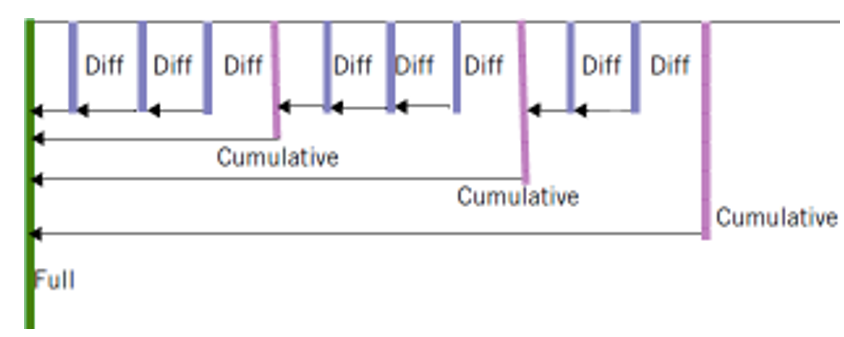

# 1 Backup and Restore

Regular backups of your user databases and system catalogs should be
taken as part of any data warehouse continuity strategy. One reason to
take backups is for disaster recovery, for example in case of a fire in
the data center. Another reason is to undo changes such as accidental
deletes.

For disaster recovery, backups should be stored in a different physical
location than the data center that hosts the data warehouse. IBM Netezza
Performance Server provides several backup and restore methods to cover
your various requirements.

The Netezza Performance Server backup and restore operations can use
network file system locations and several third-party solutions such as
IBM Spectrum Protect (formerly Tivoli® Storage Manager), Veritas
NetBackup, and EMC NetWorker as destinations.

## 1.1 Objectives

In the previous labs we created our `LABDB` database and loaded the data
into it. In this lab we will set up a QA database that contains a subset
of the tables and data of the full database. To create the tables, we
will use Cross-Database-Access from our QA database to the `LABDB`
production database.

Next we will use the schema-only function of nzbackup to create
a test database that contains the same tables and data objects as the QA
database, but no data. Test data will later be added specifically for
testing needs. After that we will do a multistep backup of our QA
database and test the restore functionality. Testing backups by
restoring them is generally a good idea and should be done during the
development phase and also at regular intervals. After all, you are
never fully sure what a backup contains until you restore it.

Finally, we will backup the system user data and the host data. While a
database backup saves all users and groups that are involved in that
database, a full user backup may be needed to get the full picture, for
example to archive users and groups that are no longer used in any
database. Host data should be backed up regularly so you can restore the
Performance Server data directory from the host backup without the
additional time to restore all of the databases.

## 2 Lab Virtual Machine

This lab system will be a virtual machine running on Virtual Box. Please
see the document on how to install the IPS Virtual Machine for your
workstation (Windows or Mac OS).

## 3 Creating a QA Database

In this lab we will create a QA database called `LABDBQA`, which contains
a subset of the tables. It will contain all of the data from the `NATION`
and `REGION` tables, along with a subset of the data from the `CUSTOMER`
table. We will create our QA database, connect to it and use `CTAS`
(Create Table As) tables to create the table copies. We will use
cross-database access to create our `CTAS` tables from the `LABDB` database.
This is possible since Netezza Performance Server allows read-only cross
database access if fully qualified names are used.

In this lab we will regularly switch between the operating system prompt
and the `NZSQL` console. The operating system prompt will be used to
execute the backup and restore commands and review the created files.
The `NZSQL` console will be used to create the tables and further review
the changes made to the user data using the restore commands.

To make this easier you should open two Terminal sessions (Terminal 1
and Terminal 2), the first one will be used to execute the operating
system commands and it will be referred to as the OS session, in the
second session we will start the `NZSQL` console. It will be referred to
as the `NZSQL` session. You can also see which session to use from the
command prompt in the screenshots.


**Figure 2** The two terminal sessions for this lab, OS session 1
(Terminal 1) on the left, nzsql session 2 (Terminal 2) on the right


1.  Open the first Terminal session. Login to <your-nps-vm-ip-address>
    as user nz with password nz. (<your-nps-vm-ip-address> is the
    default IP address for a local VM, the IP may be different for your
    Bootcamp)

2.  Access the lab directory for this lab with the following command:

=== "Input [Terminal 1]"
	```
	cd ~/labs/backupRestore/setupLab
	./setupLab.sh
	```

=== "Output"
	```
	DROP DATABASE
	ERROR:  DROP DATABASE: object LABDBQA does not exist.
	ERROR:  DROP DATABASE: object LABDBTEST does not exist.
	CREATE DATABASE
	ERROR:  CREATE USER: object LABADMIN already exists as a USER.
	ALTER USER
	ALTER DATABASE
	CREATE TABLE
	CREATE TABLE
	CREATE TABLE
	CREATE TABLE
	CREATE TABLE
	CREATE TABLE
	CREATE TABLE
	CREATE TABLE
	Load session of table 'NATION' completed successfully
	Load session of table 'REGION' completed successfully
	Load session of table 'CUSTOMER' completed successfully
	Load session of table 'SUPPLIER' completed successfully
	Load session of table 'PART' completed successfully
	Load session of table 'PARTSUPP' completed successfully
	Load session of table 'ORDERS' completed successfully
	Load session of table 'LINEITEM' completed successfully 
	```

3.  Open the second Terminal session. Login to
    `<your-nps-vm-ip-address>` as user nz with password nz.
    `<your-nps-vm-ip-address>` is the default IP address for a local
    VM, the IP may be different for your Bootcamp)

4.  Access the lab directory for this lab with the same change directory
    command:

=== "Input [Terminal 2]"
	```
	cd ~/labs/backupRestore/

	```

=== "Output"
	```
	[nz@localhost backupRestore]$
	```

5.  Start the nzsql console using the nzsql command:

=== "Input [Terminal 2]"
	```
	nzsql

	```

=== "Output"
	```
	Welcome to nzsql, the IBM Netezza SQL interactive terminal.
	
	Type:  \h for help with SQL commands
	       \? for help on internal slash commands
	       \g or terminate with semicolon to execute query
	       \q to quit
	
	SYSTEM.ADMIN(ADMIN)=>
	```
	
!!! info
	This will connect you to the `SYSTEM` database with
    the `ADMIN` user. These are the default settings stored in the
    environment variables of the NZ user.
    
6.  Create the empty QA database using the `CREATE DATABASE` command:

=== "Input [Terminal 2]"
	```
	create database LABDBQA;

	```

=== "Output"
	```
	CREATE DATABASE
	```

7.  Connect to the QA database using the `\c` command.

=== "Input [Terminal 2]"
	```
	 \c LABDBQA
	```

=== "Output"
	```
	You are now connected to database LABDBQA.
	```

8.  Create a full copy of the `REGION` table from the `LABDB` database:

=== "Input [Terminal 2]"
	```
	create table region as select * from labdb.admin.region;
	```

=== "Output"
	```
	INSERT 0 4
	```

With the `CTAS` statement, we created a local `REGION` table in the
currently connected `LABDBQA` database with the same definition and
content as the `REGION` table from the `LABDB` database. The `CREATE TABLE
AS` statement is one of the most flexible administrative tools
for an IBM Netezza Performance Server administrator.

We can easily access tables of databases we are currently not connected
to, but only for read operations. We cannot insert data into a database
we are not connected to.

9.  Verify that the content has been copied over correctly. View the
    original data in the `LABDB` database:

=== "Input [Terminal 2]"
	```
	select * from labdb.admin.region order by 1;

	```

=== "Output"
	```
	 R_REGIONKEY |          R_NAME           |          R_COMMENT          
	-------------+---------------------------+-----------------------------
	           1 | na                        | north america
	           2 | sa                        | south america
	           3 | emea                      | europe, middle east, africa
	           4 | ap                        | asia pacific
	(4 rows)
	```

You should see four rows in the result set.

To access a table from a foreign database, we need to have the fully
qualified name. Notice that we include the schema name between the two
dots. Schemas are fully supported in Performance Server and since each
table name needs to be unique in a given database it should be included.

10.  Now let's compare that to our local `REGION` table using the `SELECT`
    statement:

=== "Input [Terminal 2]"
	```
	select * from labdbqa.admin.region order by 1;
	```

=== "Output"
	```
	R_REGIONKEY |          R_NAME           |          R_COMMENT          
	-------------+---------------------------+-----------------------------
	           1 | na                        | north america
	           2 | sa                        | south america
	           3 | emea                      | europe, middle east, africa
	           4 | ap                        | asia pacific
	(4 rows)
	```
	
You should see the same rows as before.

11.  Now copy over the `NATION` table:

=== "Input [Terminal 2]"
	```
	create table nation as select * from labdb.admin.nation;
	```

=== "Output"
	```
	INSERT 0 14
	```

12.  Finally, we will copy over a subset of our `CUSTOMER` table, copying
    only the rows from the automobile market segment into the QA
    database:

=== "Input [Terminal 2]"
	```
	create table customer as select * from labdb.admin.customer 
	where c_mktsegment = 'AUTOMOBILE';
	```

=== "Output"
	```
	INSERT 0 29752
	```

Notice that this inserts 29,752 rows into the QA customer table, roughly
a fifth of the original table.

13.  Next create a view `NATIONSBYREGION` which returns a list of nation
    names with their corresponding region names. This is used in a
    couple of applications:

=== "Input [Terminal 2]"
	```
	create view nationsbyregions as select r_name, n_name 
	from nation, region where r_regionkey = n_regionkey;
	```

=== "Output"
	```
	CREATE VIEW
	```

14.  Let's have a look at what the view returns:

=== "Input [Terminal 2]"
	```
	select * from nationsbyregions order by 1;
	```

=== "Output"
	```
	          R_NAME           |          N_NAME           
	---------------------------+---------------------------
	 ap                        | australia                
	 ap                        | macau                    
	 ap                        | japan                    
	 ap                        | hong kong                
	 ap                        | new zealand              
	 emea                      | united arab emirates     
	 emea                      | portugal                 
	 emea                      | united kingdom           
	 emea                      | south africa             
	 na                        | united states            
	 na                        | canada                   
	 sa                        | brazil                   
	 sa                        | guyana                   
	 sa                        | venezuela                
	(14 rows)
	```
	
You should get a list of all nations and their corresponding region
name.

Views are a very convenient way to hide SQL complexity. They can also be
used to implement column level security by creating views of tables that
only contain a subset of columns. They are fully supported by Netezza
Performance Server.

15. Verify the created tables with the display tables command:

=== "Input [Terminal 2]"
	```
	\dt
	```

=== "Output"
	```
         List of relations
	 Schema |   Name   | Type  | Owner 
	--------+----------+-------+-------
	 ADMIN  | CUSTOMER | TABLE | ADMIN
	 ADMIN  | NATION   | TABLE | ADMIN
	 ADMIN  | REGION   | TABLE | ADMIN
	(3 rows)
	```
	

Notice that the QA database only contains the three tables we just
created.

Next create a QA user and make them owner of the database.

16. Create a user `qauser`:

=== "Input [Terminal 2]"
	```
	create user qauser;
	```

=== "Output"
	```
	CREATE USER
	```

17. Make the id `qauser` owner of the QA database called `labdbqa`:

=== "Input [Terminal 2]"
	```
	alter database labdbqa owner to qauser;
	```

=== "Output"
	```
	ALTER DATABASE
	```

We have successfully created our QA database using cross access database
CTAS statements. Our QA database contains three tables and a view, and
we have a user that is the owner of this database. In the next section
we will use backup and restore to create an empty copy of the QA
database for the test database.

## 4 Creating the Test Database

In this section, we will use schema-only backup and restore to create an
empty copy of the QA database as test database. This will not contain
any data since the developers will fill it with test-specific data.
Schema only backup is a convenient way to recreate databases without
user data.

We need to specify three parameters to the nzbackup command,
the database we want to backup, the file system location where we want
to save the backup files to and the `-schema-only` parameter to
specify that user data shouldn't be backed up.

!!! warning
	Normally backups should be saved on a
    remote network file server, not on the host hard disks. Not only is
    this essential for disaster recovery, but the host hard disks are
    small, optimized for speed and not intended to hold large amount of
    data. They are strictly intended for Netezza Performance Server
    software and operational data.

1.  Switch to the OS session and create the schema only backup of
    our QA database:

=== "Input [Terminal 1]"
	```
	nzbackup -schema-only -db labdbqa -dir /tmp/bkschema
	```

=== "Output"
	```
	Backup of schema for database labdbqa completed successfully.
	```

Later in this Lab we will have a deeper look at the files and the logs
the backup command created.

We can restore a database to a different database name. We simply need
to specify the new name in the `-db` parameter and the old name
in the `-sourcedb` parameter.

2.  Now we will restore the test database from this backup:

=== "Input [Terminal 1]"
	```
	nzrestore -dir /tmp/bkschema -db labdbtest -sourcedb labdbqa -schema-only
	```

=== "Output"
	```
	Restore of schema for database labdbtest completed successfully.
	```

3.  In the nzsql session we will verify that we successfully created an
    empty copy of our database. See all available databases with the
    following command: `\l`

=== "Input [Terminal 2]"
	```
	 \l
	```

=== "Output"
	```
	  List of databases
	 DATABASE  |  OWNER   
	-----------+----------
	 LABDB     | LABADMIN
	 LABDBQA   | QAUSER
	 LABDBTEST | QAUSER
	 SYSTEM    | ADMIN
	(4 rows)
	```
	
Notice that the `LABDBTEST` database was successfully created and the
privilege information has been copied as well, the owner is `QAUSER`,
which is the same as the owner of the `LABDBQA` database.

4.  We do not want the QA user being the owner of the test database,
    change the owner to `ADMIN` for now:

=== "Input [Terminal 2]"
	```
	alter database labdbtest owner to admin;
	```

=== "Output"
	```
	ALTER DATABASE
	```

5.  Now let's check the contents of the test database. First connect to
    the database with the `\c` command, and then display the database
    objects with the `\d` command

=== "Input [Terminal 2]"
	```
	\c labdbtest
	```

=== "Output"
	```
	You are now connected to database labdbtest.
	```

6.  Verify the test database contains all the objects of the QA
    database: `\d`

=== "Input [Terminal 2]"
	```
	 \d
	```

=== "Output"
	```
	             List of relations
	 Schema |       Name       | Type  | Owner 
	--------+------------------+-------+-------
	 ADMIN  | CUSTOMER         | TABLE | ADMIN
	 ADMIN  | NATION           | TABLE | ADMIN
	 ADMIN  | NATIONSBYREGIONS | VIEW  | ADMIN
	 ADMIN  | REGION           | TABLE | ADMIN
	(4 rows)
	```
	
You will see the three tables and the view we created.

Performance Server Backup saves all database objects including views,
stored procedures, and more. It also includes all users, groups and
privileges that refer to the database included in the backup.

7.  Since we used the `-schema-only` option we have not copied
    any data. Verify this for the `NATION` table using the `SELECT`
    command:

!!! abstract "Input"
	```
	select * from nation;
	```

=== "Output"
	```
	 N_NATIONKEY | N_NAME | N_REGIONKEY | N_COMMENT
	-------------+--------+-------------+-----------
	(0 rows)
	```

Notice the result set is empty as expected. The schema-only backup
option is a convenient way to save your database schema and to create
empty copies of your database. It will create a full 1:1 copy of the
original database without the user data. You could also restore the
database to a different Netezza Performance Server. This would only
require that the backup server location is accessible from both Netezza
Performance Servers. The target server can be another Netezza
Performance Server, which can be a different model type or have a later
software release.

## 5 Backing up and Restoring a Database

Netezza Performance Server's user data backup will create a backup of
the complete database, including all database objects and user data.
Even global objects like users and privileges that are used in the
database are backed up. This makes backup and restore a very easy and
straightforward process.

Since Netezza Performance Server doesn't have a transaction log, point
in time restore is not possible. Therefore, frequent backups are
advisable. NPS supports full, differential and cumulative backups that
allow easy and fast regular data backups. An example backup strategy
would be monthly full backups, weekly cumulative backups and daily
differentials.

Netezza Performance Server is not intended to be used nor has been
designed as an OLTP database, therefore this should provide enough
backup flexibility for most situations. For example, run differential
backups after the daily ETL processes that feed the warehouse.



**Figure 3 A typical backup strategy**

In this section we will create a backup of our QA database. We will then
do a differential backup and then do a restore.

!!! warning
	Our VMWare environment has some specific
	restrictions that only allow the restoration of up to 2 increments. The
	labs will work correctly but don't be surprised if you encounter errors
	during restore operations of more than 2 increments.

### 5.1 Backing up the Database

Netezza Performance Server's backup is organized in so called backup
sets. Every new full backup creates a new backup set. Differential and
cumulative backups are added to the last backup set by default. They can
also be added to a different backup set as well. In this section we will
switch between the two Terminal sessions.

1.  In the OS session execute the following command to create a full
    backup of the QA database:

=== "Input [Terminal 1]"
	```
	nzbackup -db labdbqa -dir /tmp/bk1 /tmp/bk2
	```
	
=== "Output"
	```
	Backup of database labdbqa to backupse 20210331133512 completed successfully.
	```

This command will create a full user data backup of the `LABDBQA`
database.

Each backup set has a unique id that can be later used to access it. By
default, the last active backup set is used for restore and differential
backups.

!!! info
	In this lab we split up the backup between two file
	system locations. You can specify up to 16 file system locations after
	the `-dir` parameter. Alternatively, you could use a directory
	list file as well with the `-dirfile` option. Splitting up the
	backup between different file servers will result in higher backup
	performance.

2.  In the NZSQL session we will now add a new row to the `REGION` table.
    First connect to the QA database using the `\c` command:

=== "Input [Terminal 2]"
	```
	\c labdbqa
	```

=== "Output"
	```
	You are now connected to database labdbqa.
	```

3.  Now add a new entry for the north pole to the `REGION` table:

=== "Input [Terminal 2]"
	```
	insert into region values (5, 'np', 'north pole');
	```

=== "Output"
	```
	INSERT 0 1
	```

Now create a differential backup with the -differential
option. This will create a new entry to the backup set we created
previously only containing the differences since the full backup.

4.  In the OS session create a differential backup:

=== "Input [Terminal 1]"
	```
	nzbackup -db labdbqa -dir /tmp/bk1 /tmp/bk2 -differential
	```

=== "Output"
	```
	Backup of database labdbqa to backupset 20210331133512 completed successfully.
	```

Notice that the backup set id hasn't changed.

5.  In the `NZSQL` session add the south pole to the `REGION` table:

=== "Input [Terminal 2]"
	```
	insert into region values (6, 'sp', 'south pole');
	```

=== "Output"
	```
	INSERT 0 1
	```

You have now one full backup with the original 4 rows in the `REGION`
table, a differential backup that has additionally the north pole entry
and a current state that has in addition to that the south pole region.

### 5.2 Verifying the Backups

In this section we will have a closer look at the files and logs that
are created during the Netezza Performance Server Backup process.

1.  In the OS session display the backup history of your Netezza
    Performance Server.

=== "Input [Terminal 1]"
	```
	nzbackup -history
	```

=== "Output"
	```
	 Database Backupset      Seq # OpType  Status    Date                Log File                      
	-------- -------------- ----- ------- --------- ------------------- ------------------------------
	LABDBQA  20210331133344 1     NO DATA COMPLETED 2021-03-31 06:33:44 backupsvr.30436.2021-03-31.log
	LABDBQA  20210331133512 1     FULL    COMPLETED 2021-03-31 06:35:12 backupsvr.30648.2021-03-31.log
	LABDBQA  20210331133512 2     DIFF    COMPLETED 2021-03-31 06:36:00 backupsvr.30859.2021-03-31.log
	```

Netezza Performance Server keeps track of all backups and saves them in
the system catalog. This is used for differential backups and it is also
integrated with the Groom process. Since Performance Server doesn't use
transaction logs it needs logically deleted rows for differential
backups. By default, Groom doesn't remove a logically deleted row that
has not been backed up yet. Therefore, the Groom process is integrated
with the backup history. We will explain this in more detail in the
Transaction and Groom Labs.

We have done three backups on our server. One backup set contains the
schema only backup, two backups for the second backup set, one full
backup and one differential. Let's have a closer look at the log that
has been generated for the last differential backup.

2.  In the OS session, switch to the log directory of the `backupsrv`
    process, which is the process responsible for backing up data:

=== "Input [Terminal 1]"
	```
	cd /nz/kit/log/backupsvr
	```

=== "Output"
	```
	[nz@localhost backupsvr]$
	```

!!! info
	The `/nz/kit/log` directory contains the log directories
	for all Performance Server processes.

3.  Display the end of the log for the last differential backup process.
    You will need to replace the `XXX` values with the actual values of
    your log. You can cut and paste the log name from the history output
    above. We are interested in the last differential backup process:

=== "Input [Terminal 1]"
	```
	tail backupsvr.xxxxx.xxxx-xx-xx.log
	```

=== "Output"
	```
	2021-03-31 06:36:04.879861 PDT (30859) Info: [30882] Postgres client pid: 30884, session: 16111
	2021-03-31 06:36:04.883271 PDT (30859) Info: [30883] Postgres client pid: 30885, session: 16112
	2021-03-31 06:36:04.892053 PDT (30859) Info: Capturing deleted rows
	2021-03-31 06:36:04.892145 PDT (30859) Info: Backing up table ADMIN.REGION
	2021-03-31 06:36:06.115265 PDT (30859) Info: Wrote 5569 bytes of metadata and udx files in less than a second
	2021-03-31 06:36:06.115362 PDT (30859) Info: Operation committed
	2021-03-31 06:36:06.115381 PDT (30859) Info: Wrote 72 bytes in less than one second to location 1
	2021-03-31 06:36:06.115384 PDT (30859) Info: Wrote 193 bytes in less than one second to location 2
	2021-03-31 06:36:06.115434 PDT (30859) Info: Backup of database labdbqa to backupset 20210331133512 completed successfully.
	2021-03-31 06:36:06.123928 PDT (30859) Info: NZ-00023: --- program 'backupsvr' (30859) exiting on host 'localhost.localdomain' ...
	```

You can see that the process backed up the three tables `REGION`, `NATION`
and `CUSTOMER` and wrote the result to two different locations. You also
see the amount of data written to these locations. Since we only added a
single row the amount of data is tiny. If you look at the log of the
full backup you will see a lot more data being written.

4.  Now let's have a look at the files that are created during the
    backup process, enter the first backup location:

=== "Input [Terminal 1]"
	```
	cd /tmp/bk1
	```

=== "Output"
	```
	[nz@localhost bk1]$
	```

5.  Display the contents of the directory using `ls -l`.

=== "Input [Terminal 1]"
	```
	ls -l
	```

=== "Output"
	```
	drwxrwxrwx. 3 nz nz 35 Mar 31 04:43 Netezza
	```

The directory contains all backup sets for all Performance Servers that
use this backup location. If you need to move the backup you always have
to move the complete folder.

6.  Change directories into the Netezza folder, with cd Netezza, and
    display the contents with `ls -l`.

=== "Input [Terminal 1]"
	```
	cd Netezza
	ls -l
	```

=== "Output"
	```
	total 0
	drwxrwxrwx. 3 nz nz 21 Mar 31 04:43 localhost.localdomain
	```

Under the main Netezza folder you will find sub folders for each Netezza
host that is backed up to this location. In our case we only have one
Netezza host called "netezza". But if your company had multiple Netezza
hosts you would find them here.

7.  Change directories to the localhost.localdomain folder with the
    cd command and display the contents with `ls -l:

=== "Input [Terminal 1]"
	```
	cd localhost.localdomain
	ls -l
	```

=== "Output"
	```
	drwxrwxrwx. 3 nz nz 28 Mar 31 04:43 LABDBQA
	```

8.  Change directories to the `LABDBQA` folder with cd and
    display the contents with ls -l:

=== "Input [Terminal 1]"
	```
	cd LABDBQA/
	ls -l
	```

=== "Output"
	```
	total 0
	drwxrwxrwx. 4 nz nz 24 Apr 5 11:44 20210331133512
	```

You will find all the databases of the host that have been backed up to
this location, in our case the QA database.

In this folder you can see all the backup sets that have been saved for
this database. Each backup set corresponds to one full backup plus an
optional set of differential and cumulative backups. Note that we backed
up the schema to a different location, so we only have one backup set in
here.

9.  Change directories to the backup set folder with cd <your
    backupset id> and display the contents with `ls -l`:

=== "Input [Terminal 1]"
	```
	cd 20210331133512 /
	ls -l
	```

=== "Output"
	```
	total 0
	drwxrwxrwx. 3 nz nz 18 Mar 31 06:35 1
	drwxrwxrwx. 3 nz nz 18 Mar 31 04:36 2
	```
	
Under the backup set are folders for each backup that has been added to
that backup set. "1" is always the full backup followed by additional
differential or cumulative backups. We will later use these numbers to
restore our database to a specific backup of the backup set.

10. Change directories to the full backup with cd and display
    the contents with `ls -l`:

=== "Input [Terminal 1]"
	```
	cd 1
	ls -l
	```

=== "Output"
	```
	total 0
	drwxrwxrwx. 4 nz nz 28 Mar 31 06:43 FULL
	```

As expected, it's a full backup.

12. Change directories to the `FULL` folder with cd and display
    the contents with `ls -l`:

=== "Input [Terminal 1]"
	```
	cd FULL
	ls -l
	```

=== "Output"
	```
	total 0
	drwxrwxrwx. 2 nz nz 94 Mar 31 06:35 data
	drwxrwxrwx. 3 nz nz 92 Mar 31 06:35 md
	```

The data folder contains the user data, the md folder contains metadata
including the schema definition of the database.

13. Change directories to the data folder with the cd command
    and display detailed information with `ls -l`:

=== "Input [Terminal 1]"
	```
	cd data
	ls -l
	```

=== "Output"
	```
	total 8
	total 1128
	-rw-------. 1 nz nz     337 Mar 31 04:43 202287.full.2.1
	-rw-------. 1 nz nz     449 Mar 31 04:43 202289.full.2.1
	-rw-------. 1 nz nz 1140681 Mar 31 04:43 202291.full.2.1
	-rw-------. 1 nz nz       1 Mar 31 04:43 data.marker
	```

14. Now switch to the md folder using cd ../md and display the
    contents with `ls -l`:

=== "Input [Terminal 1]"
	```
	cd ../md
	ls -l
	```

=== "Output"
	```
	 total 1120
	-rw-------. 1 nz nz     338 Mar 31 06:35 200580.full.2.1
	-rw-------. 1 nz nz     451 Mar 31 06:35 200582.full.2.1
	-rw-------. 1 nz nz 1132441 Mar 31 06:35 200584.full.1.1
	-rw-------. 1 nz nz       1 Mar 31 06:35 data.marker
	```
	
This folder contains information about the files that contribute to the
backup and the schema definition of the database in the schema.xml

15. Let's have a quick look inside the schema.xml file:

=== "Input [Terminal 1]"
	```
	more schema.xml
	```

=== "Output"
	```
	<ARCHIVE archive_major="4" archive_minor="0" archive_subminor="1" product_ver="Release 11.0.3.1 [Build 0]" catalog_ver="3.1792" hostname="localhost.localdomain" dataslices="1"
	 createtime="2020-04-05 18:42:23" lowercase="f" objidcycle="0" hpfrel="3.2" model="sim" family="sim" platform="sim">
	<OPERATION backupset="20200405184220" increment="1" predecessor="0" optype="0" dbname="LABDBQA"/>
	<DATABASE name="LABDBQA" schema="" owner="QAUSER" oidhi="0" oid="200820" classhi="0" class="0" delimited="f" sdelim="f" odelim="f" charset="LATIN9" collation="BINARY" collecth
	ist="t" replcsn="0" replsrcid="0" repldbid="0" replsetid="0" defschema="ADMIN" defschemadelim="f" dbtrackchanges="1">
	<SCHEMA name="ADMIN" schema="" owner="ADMIN" oidhi="0" oid="200819" classhi="0" class="0" delimited="f" sdelim="f" odelim="f" path=""/>
	<STATISTICS column_count="15"/>
	<TABLE ver="2" name="REGION" schema="ADMIN" owner="ADMIN" oidhi="0" oid="200821" classhi="0" class="4905" delimited="f" sdelim="f" odelim="f" rowsecurity="f" origoidhi="0" ori
	goid="200821" excludebackup="0">
	<COLUMN name="R_REGIONKEY" schema="" owner="" oidhi="0" oid="203501" classhi="0" class="0" delimited="f" sdelim="t" odelim="t" seq="1" type="INTEGER" typeno="23" typemod="-1" 
	notnull="t"/>
	<COLUMN name="R_NAME" schema="" owner="" oidhi="0" oid="203502" classhi="0" class="0" delimited="f" sdelim="t" odelim="t" seq="2" type="CHARACTER(25)" typeno="1042" typemod="4
	1" notnull="t"/>
	<COLUMN name="R_COMMENT" schema="" owner="" oidhi="0" oid="203503" classhi="0" class="0" delimited="f" sdelim="t" odelim="t" seq="3" type="CHARACTER VARYING(152)" typeno="1043
	" typemod="168" notnull="f"/>
	<DISTRIBUTION seq="1" attnum="1"/>
	</TABLE>
	<TABLE ver="2" name="NATION" schema="ADMIN" owner="ADMIN" oidhi="0" oid="200823" classhi="0" class="4905" delimited="f" sdelim="f" odelim="f" rowsecurity="f" origoidhi="0" ori
	goid="200823" excludebackup="0">
	<COLUMN name="N_NATIONKEY" schema="" owner="" oidhi="0" oid="203510" classhi="0" class="0" delimited="f" sdelim="t" odelim="t" seq="1" type="INTEGER" typeno="23" typemod="-1" 
	notnull="t"/>
	<COLUMN name="N_NAME" schema="" owner="" oidhi="0" oid="203511" classhi="0" class="0" delimited="f" sdelim="t" odelim="t" seq="2" type="CHARACTER(25)" typeno="1042" typemod="4
	1" notnull="t"/>
	<COLUMN name="N_REGIONKEY" schema="" owner="" oidhi="0" oid="203512" classhi="0" class="0" delimited="f" sdelim="t" odelim="t" seq="3" type="INTEGER" typeno="23" typemod="-1" 
	notnull="t"/>
	<COLUMN name="N_COMMENT" schema="" owner="" oidhi="0" oid="203513" classhi="0" class="0" delimited="f" sdelim="t" odelim="t" seq="4" type="CHARACTER VARYING(152)" typeno="1043
	" typemod="168" notnull="f"/>
	<DISTRIBUTION seq="1" attnum="1"/>
	</TABLE>
	<TABLE ver="2" name="CUSTOMER" schema="ADMIN" owner="ADMIN" oidhi="0" oid="200825" classhi="0" class="4905" delimited="f" sdelim="f" odelim="f" rowsecurity="f" origoidhi="0" o
	rigoid="200825" excludebackup="0">
	<COLUMN name="C_CUSTKEY" schema="" owner="" oidhi="0" oid="203520" classhi="0" class="0" delimited="f" sdelim="t" odelim="t" seq="1" type="INTEGER" typeno="23" typemod="-1" no
	tnull="t"/>
	<COLUMN name="C_NAME" schema="" owner="" oidhi="0" oid="203521" classhi="0" class="0" delimited="f" sdelim="t" odelim="t" seq="2" type="CHARACTER VARYING(25)" typeno="1043" ty
	pemod="41" notnull="t"/>
	<COLUMN name="C_ADDRESS" schema="" owner="" oidhi="0" oid="203522" classhi="0" class="0" delimited="f" sdelim="t" odelim="t" seq="3" type="CHARACTER VARYING(40)" typeno="1043"
	 typemod="56" notnull="t"/>
	<COLUMN name="C_NATIONKEY" schema="" owner="" oidhi="0" oid="203523" classhi="0" class="0" delimited="f" sdelim="t" odelim="t" seq="4" type="INTEGER" typeno="23" typemod="-1" 
	notnull="t"/>
	<COLUMN name="C_PHONE" schema="" owner="" oidhi="0" oid="203524" classhi="0" class="0" delimited="f" sdelim="t" odelim="t" seq="5" type="CHARACTER(15)" typeno="1042" typemod="
	31" notnull="t"/>
	<COLUMN name="C_ACCTBAL" schema="" owner="" oidhi="0" oid="203525" classhi="0" class="0" delimited="f" sdelim="t" odelim="t" seq="6" type="NUMERIC(15,2)" typeno="1700" typemod
	="983058" notnull="t"/>
	<COLUMN name="C_MKTSEGMENT" schema="" owner="" oidhi="0" oid="203526" classhi="0" class="0" delimited="f" sdelim="t" odelim="t" seq="7" type="CHARACTER(10)" typeno="1042" type
	mod="26" notnull="t"/>
	<COLUMN name="C_COMMENT" schema="" owner="" oidhi="0" oid="203527" classhi="0" class="0" delimited="f" sdelim="t" odelim="t" seq="8" type="CHARACTER VARYING(117)" typeno="1043
	" typemod="133" notnull="t"/>
	<DISTRIBUTION seq="1" attnum="1"/>
	</TABLE>
	<VIEW name="NATIONSBYREGIONS" schema="ADMIN" owner="ADMIN" oidhi="0" oid="200827" classhi="0" class="0" delimited="f" sdelim="f" odelim="f" definition="SELECT REGION.R_NAME, N
	ATION.N_NAME FROM ADMIN.NATION, ADMIN.REGION WHERE (REGION.R_REGIONKEY = NATION.N_REGIONKEY);"/>
	<USER name="QAUSER" schema="" owner="ADMIN" oidhi="0" oid="200829" classhi="0" class="0" delimited="f" sdelim="f" odelim="f" pwd="" rowsetlimit="0" validuntil="" sesstimeout="
	0" qrytimeout="0" defp="NONE" maxp="NONE" pwdinv="f" pwdlastchged="" resrcgrpid="4901" crossjoin="NULL" collecthist="0" accesstime="0" concursess="0" seclabel="PUBLIC::" audit
	cat="NONE" useauth="0">
	</USER>
	<RSG username="QAUSER" userdelim="f" groupname="PUBLIC" groupdelim="f"/>
	</DATABASE>
	</ARCHIVE>
	```
	
As you see this file contains a full XML description of your database,
including table definition, views, users etc.

16. Switch back to the lab folder:

=== "Input [Terminal 1]"
	```
	cd ~/labs/backupRestore/
	```

=== "Output"
	```
	[nz@localhost backupRestore]$
	```

You should now have a pretty good understanding of the Performance
Server Backup process. In the next section we will demonstrate the
restore functionality.

### 5.3 Restoring the Database

In this section, we will restore our database to the first increment and
then we will upgrade our database to the next increment.

Performance Server allows you to return a database to a specific
increment in your backup set. If you want to do an incremental restore,
the database must be locked. Tables can be queried but not changed until
the database is in the desired state and unlocked.

1.  In the `NZSQL` session we will drop the QA database and the QA user.
    First connect to the `SYSTEM` database:

=== "Input [Terminal 2]"
	```
	\c SYSTEM
	```

=== "Output"
	```
	You are now connected to database SYSTEM.

	SYSTEM.ADMIN(ADMIN)=>
	```

2.  Now drop the QA database:

=== "Input [Terminal 2]"
	```
	 DROP DATABASE LABDBQA;
	```

=== "Output"
	```
	DROP DATABASE
	```

3.  Now drop the QA User:

=== "Input [Terminal 2]"
	```
	DROP USER QAUSER;
	```

=== "Output"
	```
	DROP USER
	```

4.  Verify that the QA database has been deleted by displaying the
    databases using the `\l` command. You will see that the
    `LABDBQA` database has been removed:

=== "Input [Terminal 2]"
	```
	\l
	```

=== "Output"
	```
	  List of databases
	 DATABASE  |  OWNER   
	-----------+----------
	 LABDB     | LABADMIN
	 LABDBTEST | ADMIN
	 SYSTEM    | ADMIN
	(3 rows)
	```

5.  In the OS session, restore the database to the first increment:

=== "Input [Terminal 1]"
	```
	nzrestore -db labdbqa -dir /tmp/bk1 /tmp/bk2 -increment 1 -lockdb true
	```

=== "Output"
	```
	Restore of increment 1 from backupset 20210331133512 to database 'labdbqa' committed.
	```

Notice that we have specified the increment with the
`-increment` option. In our case this is the first full backup
in our backup set. We did not have to specify a backup set, by default
the most recent one is used. Since we are not sure which increment we
want to restore the database to, we have to lock the database with the
`-lockdb` option. This allows only read-only access until the
desired increment has been restored.

6.  In the `NZSQL` session, verify that the database has been recreated
    with `\l`

=== "Input [Terminal 2]"
	```
	\l
	```

=== "Output"
	```
	  List of databases
	 DATABASE  |  OWNER   
	-----------+----------
	 LABDB     | LABADMIN
	 LABDBQA   | QAUSER
	 LABDBTEST | ADMIN
	 SYSTEM    | ADMIN
	(4 rows)
	```
	

Notice the `LABDBQA` database is there. You can also see that the owner
`QAUSER` has been recreated and is again the database owner.

7.  Connect to the `LABDBQA` database with the `\c` command

=== "Input [Terminal 2]"
	```
	\c labdbqa
	```

=== "Output"
	```
	NOTICE: Database 'LABDBQA' is available for read-only
	```

You are now connected to database labdbqa.

Notice that `LABDBQA` database is currently in read-only mode.

8.  Verify the contents of the `REGION` table from the `LABDBQA` database:

=== "Input [Terminal 2]"
	```
	select * from region order by 1;
	```

=== "Output"
	```
	 R_REGIONKEY |          R_NAME           |          R_COMMENT          
	-------------+---------------------------+-----------------------------
	           1 | na                        | north america
	           2 | sa                        | south america
	           3 | emea                      | europe, middle east, africa
	           4 | ap                        | asia pacific
	(4 rows)
	```
	
Notice that we have returned the database to the point in time after the
first full backup. There is no north or south pole in the R_COMMENT
column.

9.  Try to insert a row to verify the read only mode:

=== "Input [Terminal 2]"
	```
	insert into region values (5, 'np', 'north pole');
	```

=== "Output"
	```
	ERROR: Database 'LABDBQA' is available for read-only (command ignored)
	```

As expected, this is prohibited until we unlock the database.

10. In the OS session, apply the next increment to the database

=== "Input [Terminal 1]"
	```
	nzrestore -db labdbqa -dir /tmp/bk1 /tmp/bk2 -increment next -lockdb true
	```

=== "Output"
	```
	Restore of increment 2 from backupset 20210331133512 to database 'labdbqa' committed.
	```

Notice that we now apply the second increment to the database.

11. Since we do not need to load any more increments, we can now unlock
    the database:

=== "Input [Terminal 1]"
	```
	nzrestore -db labdbqa -dir /tmp/bk1 /tmp/bk2 -unlockdb
	```

=== "Output"
	```
	[nz@localhost backupRestore]$
	```

After the database unlock, we cannot apply any further increments to
this database. To jump to a different increment, we would need to start
from the beginning.

12. In the nzsql session we will look at the `REGION` table again:

=== "Input [Terminal 2]"
	```
	select * from region order by 1;
	```

=== "Output"
	```
	 R_REGIONKEY |          R_NAME           |          R_COMMENT          
	-------------+---------------------------+-----------------------------
	           1 | na                        | north america
	           2 | sa                        | south america
	           3 | emea                      | europe, middle east, africa
	           4 | ap                        | asia pacific
	           5 | np                        | north pole
	(5 rows)
	```
	
Notice that we have added the north pole region, which was created
before the first differential backup.

13. Verify that the database is unlocked and ready for use again by
    adding a new set of customers to the `CUSTOMER` table. In addition to
    the Automobile users we want to add the machinery users from the
    main database:

=== "Input [Terminal 2]"
	```
	insert into customer select * fromlabdb.admin.customer where c_mktsegment = 'MACHINERY';
	```

=== "Output"
	```
	INSERT 0 29949
	```

Notice that we now can use the database in a normal fashion again.

14. We had around 30000 customers before, verify that the new user set
    has been added successfully:

=== "Input [Terminal 2]"
	```
	select count(*) from customer;
	```

=== "Output"
	```
	 COUNT 
	-------
	 59701
	(1 row)
	```
	
You will see that we now have around 60000 rows in the `CUSTOMER` table.

You have now done a full restore cycle for the database and applied a
full and incremental backup to your database. In the next section we
will demonstrate single table restore and the ability to restore from
any backup set.

### 5.4 Single Table Restore

In this chapter we will demonstrate the targeted restore of a subset of
tables from a backup set. We will also demonstrate how to restore from a
specific older backup set.

1.  First, we will create a second backup set with the new customer
    data. In the OS session execute the following command:

=== "Input [Terminal 1]"
	```
	nzbackup -db labdbqa -dir /tmp/bk1 /tmp/bk2
	```

=== "Output"
	```
	Backup of database labdbqa to backupset 20210331134349 completed successfully.
	```

Notice that this is a full database backup because we took the defaults.
In this case Netezza Performance Server automatically creates a new
backup set.

2.  We want to return the `CUSTOMER` table to the previous condition. But
    we do not want to change the `REGION` or the `NATION` tables. To do this
    we need to know the backup set id of the previous backup set. To do
    this execute the history command again:

=== "Input [Terminal 1]"
	```
	nzbackup -history
	```

=== "Output"
	```
	 Database  Backupset      Seq # OpType  Status    Date                Log File                      
	--------- -------------- ----- ------- --------- ------------------- ------------------------------
	(LABDBQA) 20210331133344 1     NO DATA COMPLETED 2021-03-31 06:33:44 backupsvr.30436.2021-03-31.log
	(LABDBQA) 20210331133512 1     FULL    COMPLETED 2021-03-31 06:35:12 backupsvr.30648.2021-03-31.log
	(LABDBQA) 20210331133512 2     DIFF    COMPLETED 2021-03-31 06:36:00 backupsvr.30859.2021-03-31.log
	LABDBQA   20210331134349 1     FULL    COMPLETED 2021-03-31 06:43:49 backupsvr.31972.2021-03-31.log
	```

We now see three different backup sets, the schema only backup, the two
step backupset and the new full backupset. Remember the backup set id of
the two step backupset.

3.  To return only the `CUSTOMER` table to its condition of the second
    backup set, we can do a table level restore with the following
    command:

=== "Input [Terminal 1]"
	```
	nzrestore -db labdbqa -dir /tmp/bk1 /tmp/bk2 -backupset 20210331133512 -tables CUSTOMER
	```

=== "Output"
	```
	Error: Specify -droptables to force drop of tables in the -tables list.
	```

This command will only restore the tables in the -tables option. If you
want to restore multiple tables, you can simply write them in a list
after the option.

We use the `-backupset` option to specify a specific backup set. Remember
to replace the id with the value you retrieved with the history command.

!!! info
	Notice that the table name needs to be case
	sensitive. This is in contrast to the database name. You will get the
	error "Performance Server cannot restore a table that exists in the
	target database. You can either drop the table before restoring it or
	use the -droptables option."

4.  Repeat the previous command with the added -droptables option:

=== "Input [Terminal 1]"
	```
	nzrestore -db labdbqa -dir /tmp/bk1 /tmp/bk2 -backupset 20210331133512 -tables CUSTOMER -droptables
	```

=== "Output"
	```
	[Restore Server] : Dropping TABLE 'CUSTOMER'
	[Restore Server] : Dropping TABLE 'CUSTOMER'
	Restore of increment 1 from backupset 20210331133512 to database 'labdbqa' committed.
	Restore of increment 2 from backupset 20210331133512 to database 'labdbqa' committed.
	```
	
Notice that the target table was dropped before the restore happened and
the specified backup set was used. Since we didn't stipulate a specific
increment, the full backup set has been applied with all increments.
Also, the table is automatically unlocked after the restore process
finishes.

5.  Finally let's verify that the restore worked as expected, in the
    NZSQL console count the rows of the customer table again:

=== "Input [Terminal 2]"
	```
	select count(*) from customer;
	```

=== "Output"
	```
	 COUNT 
	-------
	 29752
	(1 row)
	```
	
You will see that we are back to approximately 30000 rows. This means
that we have backed out the most recent changes.

In this chapter you executed a single table restore and you did a
restore from a specific backup set.

## 6 Backing up User Data and Host Data

In the previous chapters you have learned to backup Performance Server
databases. This backs up all the database objects that are used in the
database and the user data. These are the most critical components to
back up in a Performance Server. They will allow you to recreate your
databases even if you switch to a completely new Netezza Performance
Server.

There are two other things that should be backed up:

-   The global user information.

-   The host data

In this chapter you will do a backup of these components, so you would
be able to revert your IBM Netezza Performance Server to the exact
condition it was in before the backup.

### 6.1 User Data Backup

Users, groups, and privileges that are not used in databases will not be
backed up by the user data backup. To be able to revert a Performance
Server completely to its original condition you need to have a backup of
the global user information as well, to capture for example
administrative users that are not part of any database.

This is done with the `-users` option of the `nzbackup`
command:

1.  In the OS session execute the following command.

=== "Input [Terminal 2]"
	```
	nzbackup -dir /tmp/bk1 /tmp/bk2 -users
	```

=== "Output"
	```
	Backup of global objects completed successfully.
	```

This will create a backup of all Users, Groups and Privileges. Restoring
it will not delete any users, instead it will only add missing Users,
Groups and Privileges, so it doesn't need to be fully synchronized with
the user data backup. You can even restore an older user backup without
fear of destroying information.

### 6.2 Host Data Backup

Until now we have always backed up database content. This is essentially
catalog and user data that can be applied to a new Performance Server.
Performance Server also provides the functionality to backup and restore
host data. This is essentially the data in the `/nz/data` and `/export/nz`
directories of the host server.

There are two reasons for regularly backing up host data. The first is a
host crash. If the data on your system is intact but the host file
system has been destroyed, you can recreate all databases from the user
backup. In very large systems this might take a long time. It is much
easier to just restore the host information and reconnect to the
undamaged user tables.

The second reason is that the host data contains configuration
information, log and plan files etc. that are not saved by the user
backup. If you changed the system configuration that information would
be lost. Therefore, it is advisable to regularly backup host data.

1.  To backup the host data execute the following command in the OS
    session:

=== "Input [Terminal 2]"
	```
	nzhostbackup /tmp/hostbackup
	```

=== "Output"
	```
	Starting host backup. System state is 'online'.
	Pausing the system ...
	Checkpointing host catalog ...
	Archiving system catalog ...
	Resuming the system ...
	Host backup completed successfully. System state is 'online'.
	```

As you can see, the system was paused for the duration of the host
backup but is automatically resumed after the backup is successful. Also
notice that the host backup is done with the `nzhostbackup` command
instead of the standard `nzbackup` command.

2.  Let's have a look at the created file:

=== "Input [Terminal 2]"
	```
	ls -l /tmp
	```

=== "Output"
	```
	total 389308
	drwxrwxrwx. 3 nz nz 21 Apr 5 11:42 bk1
	drwxrwxrwx. 3 nz nz 21 Apr 5 11:42 bk2
	drwxrwxrwx. 3 nz nz 21 Apr 5 11:37 bkschema
	-rw-r--r--. 1 root root 36730 Apr 6 03:54 cyclops_run.log
	-rw-------. 1 nz nz 398447694 Apr 6 03:52 hostbackup
	...
	```
	
Notice that a backup file has been created. It's a compressed file
containing the system catalog and Performance Server host information.
If possible, host backups should be done regularly. If an old host
backup is restored, there might be some orphaned tables. Orphan tables
are tables that were created after the host backup and consume disk
space but are not registered in the system catalog anymore. During host
restore, Performance Server will create a script to clean up these
orphaned tables.

!!! success "Congratulations on finishing the chapter!"
	Congratulations you have finished the Backup & Restore lab and you have
	had a chance to see all components of a successful Performance Server
	backup strategy. In this lab, we used the file system backup. In a real
	Performance Server backup and restore operation, we would most likely
	use third-party solutions such as IBM Spectrum Protect (formerly Tivoli®
	Storage Manager), Veritas NetBackup, and EMC NetWorker as destinations.

	For further information regarding the setup steps please refer to the
	IBM Knowledge Center for Netezza Performance Server.