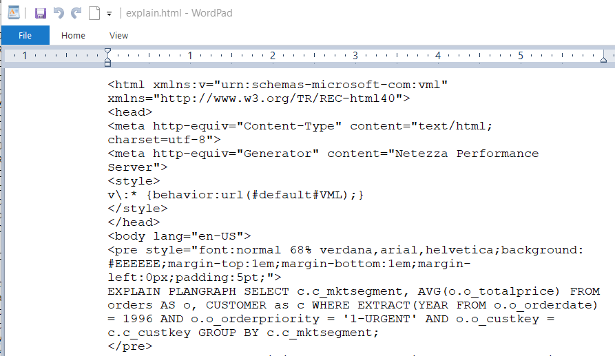
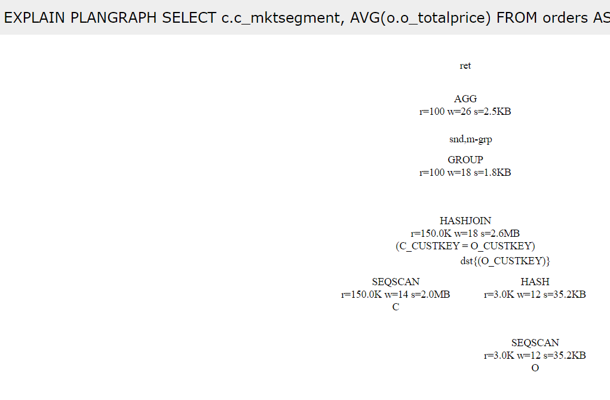

# Query Optimization

Netezza Performance Server uses a cost-based optimizer to determine the
best method for scan and join operations, join order, and data movement
between SPUs (redistribute or broadcast operations if necessary). For
example, the planner tries to avoid redistributing large tables because
of the performance impact. The optimizer can also dynamically rewrite
queries to improve query performance.

The optimizer takes a SQL query as input and creates a detailed
execution or query plan for the database system. For the optimizer to
create the best execution plan that results in the best performance, it
must have the most up-to-date statistics. You can use `EXPLAIN`, HTML
(also known as bubble), and text plans to analyze how the Netezza
Performance Server system executes a query.

Explain is a very useful tool to spot and identify performance problems,
bad distribution keys, badly written SQL queries and out-of-date
statistics.

## 1 Objectives

During our POC we have identified a couple of very long running customer
queries that have significantly worse performance than the number of
rows involved would suggest. In this lab we will use Explain
functionality to identify the concrete bottlenecks and if possible, fix
them to improve query performance.

## 2 Lab Setup

This lab uses an initial setup script to make sure the correct user and
database exist for the remainder of the lab. Follow the instructions
below to run the setup script.

1.  Login to NPS Command Line using one of these two methods.

    a.  Login to the VM directly and use the terminal application
        available inside the VM.

    b.  Connect to your Netezza Performance Server image using putty

2.  If you are continuing from the previous lab and are already
    connected to `NZSQL` quit the `NZSQL` console with the `\q`
    command.

3.  Prepare for this lab by running the setup script. To do this use the
    following two commands:
	
	=== "Input"
		```
		cd ~/labs/queryOptimization/setupLab
		./setupLab.sh
		```
	
	=== "Output"
		```
		DROP DATABASE	
		CREATE DATABASE	
		DROP USER	
		CREATE USER	
		ALTER USER	
		ALTER DATABASE	
		CREATE TABLE	
		CREATE TABLE	
		CREATE TABLE	
		CREATE TABLE	
		CREATE TABLE	
		CREATE TABLE	
		CREATE TABLE	
		CREATE TABLE	
		Load session of table 'NATION' completed successfully	
		Load session of table 'REGION' completed successfully	
		Load session of table 'CUSTOMER' completed successfully	
		Load session of table 'SUPPLIER' completed successfully	
		Load session of table 'PART' completed successfully	
		Load session of table 'PARTSUPP' completed successfully	
		Load session of table 'ORDERS' completed successfully	
		Load session of table 'LINEITEM' completed successfully	
		```

There may be error message at the beginning of the output since the
script tries to clean up existing databases and users.

4.  Switch to the lab directory `~/labs/queryOptimization`. To do this
    use the following command: (Notice that you can use bash auto
    complete by using the Tab key to complete folder and files names)
	
	=== "Input"
		```
		cd ~/labs/queryOptimization
		```
	
	=== "Output"
		```
		[nz@localhost queryOptimization]$
		```
	
	The command line prompt changes to reflect the directory you are in
	(`queryOptimization`).

## 3 Generate Statistics

Cost based optimizers depend on accurate information about the data in
the tables in order to generate well optimized query plans. This part of
the lab looks at the importance of having up to date statistics about
the table data, such as number of rows, size of the rows, size of the
table, number of columns, number of unique values in each column, etc.
The generate statistics command is used to collect the statistical
information about the tables and columns.

Our first long running customer query returns the average order price by
customer segment for a given year and order priority. It joins the
customer table for the market segment and the orders table for the total
price of the order. Due to restrictive join conditions it shouldn't
require too much processing time. But on our test systems it runs a very
long time. In this chapter we will use Netezza Performance Server's
Explain functionality to find out why this is the case. The customer
query in question:

=== "Customer Query"
	```
	SELECT c.c_mktsegment, AVG(o.o_totalprice)
	FROM orders AS o, CUSTOMER as c
	WHERE EXTRACT(YEAR FROM o.o_orderdate) = 1996 AND o.o_orderpriority = '1-URGENT'
	GROUP BY c.c_mktsegment;
	```

1.  First, we will make sure that the system doesn't run a different
	    workload that could influence our tests. Use the following `nzsession`
	    command to verify that the system is free:
	
	=== "Input"
		```
		nzsession show
		```
	
	=== "Output"
		```
		ID    Type User  Start Time              PID   Database Schema State  Priority Name Client IP Client PID Command
		----- ---- ----- ----------------------- ----- -------- ------ ------ ------------- --------- ---------- ------------------------
		21920 sql  ADMIN 03-Apr-20, 16:35:54 PDT 15500 SYSTEM   ADMIN  active normal        127.0.0.1      15497 SELECT session_id, clien
		```
	
	This result shows that there is currently only one session connected
	to the database, which is the `nzsession` command itself. Per default
	the database user in your VM image is `ADMIN`. Executing this command
	before doing any performance measurements ensures that other workloads
	are not influencing the performance of the system. You can use the
	`nzsession` command as well to abort bad or locked sessions.
	
2.  After we verified that the system is free, we can start analyzing
	    the query. Connect to the lab database with the following command:
	
	=== "Input"
		```
		nzsql labdb labadmin
		```
	
	=== "Output"
		```
		Welcome to nzsql, the IBM Netezza SQL interactive terminal.	
		
		Type: \h for help with SQL commands	
		\? for help on internal slash commands	
		\g or terminate with semicolon to execute query	
		\q to quit	
		
		LABDB.ADMIN(LABADMIN)=>
		```
	
3.  Let's first have a look at the two tables and the `WHERE` conditions
	    to get an idea of the row numbers involved. Our query joins the
	    `CUSTOMER` table without any where condition applied to it and the
	    `ORDERS` table that has two where conditions restricting it on the
	    date and order priority. From the data distribution lab, we know
	    that the `CUSTOMER` table has 150000 rows. To get the rows that are
	    involved from the `ORDERS` table Execute the following `COUNT(*)`
	    command:
	
	=== "Input"
		```
		SELECT COUNT(*) FROM orders 
		WHERE EXTRACT(YEAR FROM o_orderdate) = 1996 AND 
		o_orderpriority = '1-URGENT';
		```
	=== "Output"
		```
		COUNT	
		-------	
		46014	
		(1 row)
		```
	
	So, the `ORDERS` table has 46014 rows that fit the `WHERE` condition. We
	will use `EXPLAIN` functionality to check if the available Statistics
	allow the Netezza Performance Server optimizer to estimate this
	correctly for its plan creation.
	
4.  The Netezza Performance Server optimizer uses statistics about the
	    data in the system to estimate the number of rows that result from
	    `WHERE` conditions, joins, etc. Doing wrong approximations can lead to
	    bad execution plans. For example, a huge result set could be
	    broadcast for a join instead of doing a double redistribution. To
	    see its estimated rows for the `WHERE` conditions in our query run the
	    following `EXPLAIN` command:
	
	=== "Input"
		```
		EXPLAIN VERBOSE SELECT COUNT(*) FROM orders	
		WHERE EXTRACT(YEAR FROM o_orderdate) = 1996 AND o_orderpriority  = '1-URGENT';
		```
	
	=== "Output"
		```
		EXPLAIN VERBOSE SELECT COUNT(*) FROM orders WHERE EXTRACT(YEAR FROM o_orderdate) = 1996 AND o_orderpriority = '1-URGENT';
		
		QUERY VERBOSE PLAN:
		
		Node 1.
		  [SPU Sequential Scan table "ORDERS" {(ORDERS.O_ORDERKEY)}]
		      -- Estimated Rows = 150, Width = 0, Cost = 0.0 .. 1653.2, Conf = 64.0
		      Restrictions:
		        ((ORDERS.O_ORDERPRIORITY = '1-URGENT'::BPCHAR) AND (DATE_PART('YEAR'::"VARCHAR", ORDERS.O_ORDERDATE) = 1996))
		      Projections:
		Node 2.
		  [SPU Aggregate]
		      -- Estimated Rows = 1, Width = 8, Cost = 1653.2 .. 1653.2, Conf = 0.0
		      Projections:
		        1:COUNT(*)
		  [SPU Return]
		  [HOST Merge Aggs]
		  [Host Return]
		
		..<Removed Plan Text>..
		
		```
	
	The execution plan of this query consists of two nodes or snippets.
	First the table is scanned and the `WHERE` conditions are applied, which
	can be seen in the Restrictions sub node. Since we use a `COUNT(*)` the
	Projections node is empty. Then an Aggregation node (Node 2) is
	applied to count the rows that are returned by node 1.
	
	When we look at the estimated number of rows, we can see that it is
	way off the mark. The Netezza Performance Server Optimizer estimates
	from its available statistics that only 150 rows are returned by the
	`WHERE` conditions. We have seen before that in reality its 46014 or
	roughly 300 times as many.
	
5.  One way to help the optimizer in its estimates is the collection of
	    detailed statistics about the involved tables. Execute the following
	    command to generate full, detailed statistics about the `ORDERS`
	    table:
	
	=== "Input"
		```
		GENERATE STATISTICS ON orders;
		```
	
	=== "Output"
		```
		GENERATE STATISTICS
		```
	
	Since generating full statistics involves a table scan this command
	may take some time to execute, especially on a table with many rows
	and columns.
	
6.  We will now check if generating statistics has improved the
	    estimates. Execute the `EXPLAIN` command again:
	
	=== "Input"
		```
		EXPLAIN VERBOSE SELECT COUNT(*) FROM orders	
		WHERE EXTRACT(YEAR FROM o_orderdate) = 1996 AND o_orderpriority = '1-URGENT';
		```
	
	=== "Output"
		```
		EXPLAIN VERBOSE SELECT COUNT(*) FROM orders WHERE EXTRACT(YEAR FROM o_orderdate) = 1996 AND o_orderpriority = '1-URGENT';
		
		QUERY VERBOSE PLAN:
		
		Node 1.
		  [SPU Sequential Scan table "ORDERS" {(ORDERS.O_ORDERKEY)}]
		      -- Estimated Rows = 3000, Width = 0, Cost = 0.0 .. 1653.2, Conf = 64.0
		      Restrictions:
		        ((ORDERS.O_ORDERPRIORITY = '1-URGENT'::BPCHAR) AND (DATE_PART('YEAR'::"VARCHAR", ORDERS.O_ORDERDATE) = 1996))
		      Projections:
		Node 2.
		  [SPU Aggregate]
		      -- Estimated Rows = 1, Width = 8, Cost = 1653.4 .. 1653.4, Conf = 0.0
		      Projections:
		        1:COUNT(*)
		  [SPU Return]
		  [HOST Merge Aggs]
		  [Host Return]
		
		..< Removed Plan Text >..
		```
	
	As we can see the estimated rows of the `SELECT` query have improved
	drastically. The optimizer now assumes this `WHERE` condition will apply
	to 3000 rows of the order table. Still significantly off the true
	number of 46000 but by a factor of 20 better than the original
	estimate of 150.
	
	Estimations are very difficult to make. Obviously, the optimizer cannot
	do the actual computation during planning. It relies on current
	statistics about the involved columns. Statistics include min/max
	values, distinct values, numbers of null values etc. Some of these
	statistics are collected on the fly but the most detailed statistics can
	be generated manually with the Generate Statistics command (or the
	`nz_genstats` command with "full" option). Generating full statistics
	after loading a table or changing its content significantly is one of
	the most important administration tasks in Netezza Performance Server.
	The Netezza Performance Server appliance will automatically generate
	express statistics after many tasks like load operations and
	just-in-time statistics during planning. Nevertheless, full statistics
	should be generated on a regular basis.

## 4 Identifying Join Problems

In the last chapter we have taken a first look at the tables involved in
our join query and have improved optimizer estimates by generating
statistics on the involved tables. Now we will have a look at the
complete execution plan, and we will have a specific look at the
distribution and involved join.

In our example we have a query that doesn't finish in a reasonable
amount of time. It is taken much longer than you would expect from the
involved data sizes. We will now analyze why this is the case.

1.  Let's analyze the execution plan for this query using the `EXPLAIN VERBOSE` command:
	
	=== "Input"
		```
		EXPLAIN VERBOSE 
		SELECT c.c_mktsegment,	AVG(o.o_totalprice) 
		  FROM orders AS o, CUSTOMER as c 
		WHERE EXTRACT(YEAR	FROM o.o_orderdate) = 1996 AND o.o_orderpriority = '1-URGENT' 
		GROUP BY c.c_mktsegment;
		```
	
	=== "Output"
		```
		EXPLAIN VERBOSE SELECT c.c_mktsegment, AVG(o.o_totalprice) FROM orders AS o, CUSTOMER as c WHERE EXTRACT(YEAR FROM o.o_orderdate) = 1996 AND o.o_orderpriority = '1-URGENT' GROUP BY c.c_mktsegment;
		
		QUERY VERBOSE PLAN:
		
		Node 1.
		  [SPU Sequential Scan table "CUSTOMER" as "C" {(C.C_CUSTKEY)}]
		      -- Estimated Rows = 150000, Width = 10, Cost = 0.0 .. 258.4, Conf = 100.0
		      Projections:
		        1:C.C_MKTSEGMENT
		  [SPU Broadcast]
		Node 2.
		  [SPU Sequential Scan table "ORDERS" as "O" {(O.O_ORDERKEY)}]
		      -- Estimated Rows = 3000, Width = 8, Cost = 0.0 .. 1653.2, Conf = 64.0
		      Restrictions:
		        ((O.O_ORDERPRIORITY = '1-URGENT'::BPCHAR) AND (DATE_PART('YEAR'::"VARCHAR", O.O_ORDERDATE) = 1996))
		      Projections:
		        1:O.O_TOTALPRICE
		Node 3.
		  [SPU Nested Loop Stream "Node 2" with Temp "Node 1" {(O.O_ORDERKEY)}]
		      -- Estimated Rows = 450000007, Width = 18, Cost = 660086.9 .. 7306828.5, Conf = 64.0
		      Restrictions:
		        't'::BOOL
		      Projections:
		        1:C.C_MKTSEGMENT  2:O.O_TOTALPRICE
		Node 4.
		  [SPU Group]
		      -- Estimated Rows = 100, Width = 18, Cost = 660086.9 .. 7341984.7, Conf = 0.0
		      Projections:
		        1:C.C_MKTSEGMENT  2:O.O_TOTALPRICE
		  [SPU Return]
		  [HOST Merge Group]
		Node 5.
		  [Host Aggregate]
		      -- Estimated Rows = 100, Width = 26, Cost = 660086.9 .. 7341984.7, Conf = 0.0
		      Projections:
		        1:C.C_MKTSEGMENT  2:(SUM(O.O_TOTALPRICE) / "NUMERIC"(COUNT(O.O_TOTALPRICE)))
		  [Host Return]
		
		..<Removed Plan Text>..
		```
	
2.  First try to answer the following questions through the execution
	    plan yourself. Take your time. We will walk through the answers
	    after that.
	
	| **Question**                         | **Answer**                     |
	|--------------------------------------|--------------------------------|
	| a.  Which columns of Table CUSTOMER are used in further  computations? |   &nbsp;&nbsp;&nbsp;&nbsp;&nbsp;&nbsp;&nbsp;&nbsp;&nbsp;&nbsp;&nbsp;&nbsp;&nbsp;&nbsp;&nbsp;&nbsp;&nbsp;&nbsp;&nbsp;&nbsp;&nbsp;&nbsp;&nbsp;&nbsp;&nbsp;&nbsp;&nbsp;&nbsp;&nbsp;&nbsp;&nbsp;&nbsp;&nbsp;                            |
	| b.  Is Table CUSTOMER redistributed, broadcast or can it be joined locally? |                                |
	| c.  Is Table ORDERS redistributed, broadcast or can it be joined locally? |                                |
	| d.  In which node are the WHERE  conditions applied and how many   rows does Netezza Performance  Server expect to fulfill the where condition? |                                |
	| e.  What kind of join takes place and in which node?   |                                |
	| f.  What is the number of estimated rows for the join? |                                |
	| g.  What is the most expensive node and why? |                                |
	
	Hint: A stream operation in Netezza Performance Server Explain is an
	operation whose output data isn't persisted on disk but streamed to
	further computation nodes or snippets for a local join or local
	aggregation. No data is broadcast or redistributed in a stream
	operation.
	
3.  So let's walk through the questions:
	
	a.  Which columns of Table `CUSTOMER `are used in further computations?
	
    The first node in the execution plan does a sequential scan of the
    `CUSTOMER` table on the SPUs. It estimates that 150000 rows are returned
    which we know is the number of rows in the `CUSTOMER` table.
        	    
	```
	Node 1.
	  [SPU Sequential Scan table "CUSTOMER" as "C" {(C.C_CUSTKEY)}]
	      -- Estimated Rows = 150000, Width = 10, Cost = 0.0 .. 258.4, Conf = 100.0
	      Projections:
	        1:C.C_MKTSEGMENT
	  [SPU Broadcast]
	```

	The statement that tells us which columns are used in further
	computations is the "Projections:" clause. We can see that only the
	`C_MKTSEGMENT` column is carried on from the `CUSTOMER` table. All other
	columns are thrown away. Since `C_MKTSEGMENT` is a `CHAR(10)` column the
	returned result set has a width of 10.

	b.  Is Table `CUSTOMER` redistributed, broadcast or can it be joined
    locally?

	During scan the `CUSTOMER` table is broadcast to the other SPUs as seen
	by the "[SPU Broadcast]" clause in Node 1. This means that a
	complete `CUSTOMER` table is assembled on the host and broadcast to each
	SPU for further computation of the query. This may seem surprising at
	first since we have a substantial number of rows. But since the width
	of the result set is only 10 Bytes we are talking about 150000 rows *
	10 Bytes = 1.5MB. This is a small amount of data for a warehousing
	system.

	c.  Is Table `ORDERS` redistributed, broadcast or can it be joined
    locally?
	```
	Node 2.
	  [SPU Sequential Scan table "ORDERS" as "O" {(O.O_ORDERKEY)}]
	      -- Estimated Rows = 3000, Width = 8, Cost = 0.0 .. 1653.2, Conf = 64.0
	      Restrictions:
	        ((O.O_ORDERPRIORITY = '1-URGENT'::BPCHAR) AND (DATE_PART('YEAR'::"VARCHAR", O.O_ORDERDATE) = 1996))
	      Projections:
	        1:O.O_TOTALPRICE
	
	```
	The second node of the execution plan does a scan of the `ORDERS` table.
	One column `O_TOTALPRICE` is projected and used in further computations.
	We cannot see any distribution or broadcast clauses so this table can
	be joined locally. This is true because the `CUSTOMER` table is
	broadcast to all SPUs. If one table of a join is broadcast the other
	table doesn't need any redistribution.
	
	d.  In which node are the `WHERE` conditions applied and how many rows
	    does Netezza Performance Server expect to fulfill the `WHERE`
	    condition?
	
	We can see from the "Restrictions" clause in Node 2 that the `WHERE`
	conditions of our query are applied here. This should be clear since
	both `WHERE` conditions are applied to the `ORDERS` table and the
	restriction of rows can occur during the scan of the `ORDERS` table. As
	we can see in the "Estimated Rows" clause, the optimizer estimates a
	returned set of 3000 rows. We know this is not a perfect estimate
	since we found 46014 rows are returned from this table.
	
	e.  What kind of join takes place and in which node?
	```
	Node 3.
	  [SPU Nested Loop Stream "Node 2" with Temp "Node 1" {(O.O_ORDERKEY)}]
	      -- Estimated Rows = 450000007, Width = 18, Cost = 660086.9 .. 7306828.5, Conf = 64.0
	      Restrictions:
	        't'::BOOL
	      Projections:
	        1:C.C_MKTSEGMENT  2:O.O_TOTALPRICE
	```
	The third node of our execution plan contains the join between the two
	tables. It is a Nested Loop Join which means that every row of the
	first join set is compared to each row of the second join set. If the
	join condition holds true, the joined row is then added to the result
	set. This can be a very efficient join for small tables but for large
	tables its complexity is quadratic and therefore in general less fast
	than a Hash Join. However, Hash Joins cannot be used in the case of
	inequality join conditions, floating point join keys etc.
	
	Also look at the two columns that continue to be projected for further
	use in the query plan. These are the columns that were projected from
	Node 1 and Node 2.
	
	f.  What is the number of estimated rows for the join?
	
	We can see in the "Estimated Rows" clause that the optimizer estimates
	this join node to return roughly 450m rows. The 450m rows is the
	number of rows from the first node times the number of rows from the
	second node.
	
	g.  What is the most expensive node and why?
	
	The "Cost" clause provides an estimate of how expensive a Node is,
	where a higher cost usually leads to longer execution time. As we can
	see from the "Cost" clause in Node 3, the optimizer estimates that the
	join has a cost in the range from 660086.9 .. 7306828.5. This is a
	dramatically higher cost than what was estimated for Node 1 and Node
	2. Node 4 and 5, which group and aggregate the result set, do not add
	much cost eitherl. So, our performance problems clearly originate in
	the join node 3.
	 
	So, what is happening here? If we look at the query, we can assume
	that it is intended to compute the average order cost per market
	segment. This means we should join all customers to their
	corresponding order rows. But for this to happen we would need a join
	condition that joins the `CUSTOMER` table and the `ORDERS` table on the
	customer key. Instead the query performs a Cartesian Join, joining
	each customer row to each orders row. This is a very work intensive
	query that results in the behavior we have seen. The joined result set
	becomes huge. And the result does not answer the question that we
	intended to ask.
	
4.  So how do we fix this? By adding a join condition to the query that
	    makes sure that customers are only joined to their orders. This
	    additional join condition is `O.O_CUSTKEY=C.C_CUSTKEY`. Execute the
	    following `EXPLAIN` command for the modified query.
	
	=== "Input"
		```
		EXPLAIN VERBOSE 
		SELECT c.c_mktsegment, AVG(o.o_totalprice) 
		  FROM orders AS o, CUSTOMER as c 
		WHERE EXTRACT(YEAR	FROM o.o_orderdate) = 1996 AND o.o_orderpriority = '1-URGENT' AND	
		o.o_custkey = c.c_custkey 
		GROUP BY c.c_mktsegment;]
		```
	
	=== "Output"
		```
		EXPLAIN VERBOSE SELECT c.c_mktsegment, AVG(o.o_totalprice) FROM orders AS o, CUSTOMER as c WHERE EXTRACT(YEAR FROM o.o_orderdate) = 1996 AND o.o_orderpriority = '1-URGENT' AND o.o_custkey = c.c_custkey GROUP BY c.c_mktsegment;
		
		QUERY VERBOSE PLAN:
		
		Node 1.
		  [SPU Sequential Scan table "ORDERS" as "O" {(O.O_ORDERKEY)}]
		      -- Estimated Rows = 3000, Width = 12, Cost = 0.0 .. 1653.2, Conf = 64.0
		      Restrictions:
		        ((O.O_ORDERPRIORITY = '1-URGENT'::BPCHAR) AND (DATE_PART('YEAR'::"VARCHAR", O.O_ORDERDATE) = 1996))
		      Projections:
		        1:O.O_TOTALPRICE  2:O.O_CUSTKEY
		      Cardinality:
		        O.O_CUSTKEY 3.0K (Adjusted)
		  [SPU Distribute on {(O.O_CUSTKEY)}]
		  [HashIt for Join]
		Node 2.
		  [SPU Sequential Scan table "CUSTOMER" as "C" {(C.C_CUSTKEY)}]
		      -- Estimated Rows = 150000, Width = 14, Cost = 0.0 .. 258.4, Conf = 100.0
		      Projections:
		        1:C.C_MKTSEGMENT  2:C.C_CUSTKEY
		Node 3.
		  [SPU Hash Join Stream "Node 2" with Temp "Node 1" {(O.O_CUSTKEY,C.C_CUSTKEY)}]
		      -- Estimated Rows = 150000, Width = 18, Cost = 1653.2 .. 2015.2, Conf = 51.2
		      Restrictions:
		        (C.C_CUSTKEY = O.O_CUSTKEY)
		      Projections:
		        1:C.C_MKTSEGMENT  2:O.O_TOTALPRICE
		      Cardinality:
		        O.O_CUSTKEY 100 (Adjusted)
		
		..<Removed Plan Text>..
		```
	
	As you can see there have been some changes to the execution plan. The
	`ORDERS` table is now scanned and distributed on the customer key rather
	than broadcast. The `CUSTOMER` table is already distributed on the
	customer key, so no redistribution needs to happen. Both tables are
	then joined in node 3 through a Hash Join on the customer key, as seen
	in the "Restrictions" clause. Also see how the join key of each table
	is now projected in Node 1 and Node 2 so the join can be done in Node
	3. The estimated number of rows is now 150000, the same as the number
	of customers. Since we have a 1:n relationship between customers and
	orders this is as we would expect. Also, the estimated cost of Node 3
	has come down by over a factor of 100!
	
5.  Let's make sure that the query performance has indeed improved.
	    Switch on the display of elapsed query time with the following
	    command:
	    
	=== "Input"
		```
		\time
		```
	
	If you want, you can later switch off the elapsed time display by
	executing the same command again. It is a toggle.
	
6.  Now execute our modified query:
		
	=== "Input"
		```
		SELECT c.c_mktsegment, AVG(o.o_totalprice)	
		FROM orders AS o,CUSTOMER as c 
		WHERE EXTRACT(YEAR FROM o.o_orderdate) = 1996 AND 
		o.o_orderpriority = '1-URGENT' AND 
		o.o_custkey = c.c_custkey	
		GROUP BY c.c_mktsegment;
		```
	
	=== "Output"
		```
		 C_MKTSEGMENT |      AVG
		--------------+---------------
		 BUILDING     | 151275.977882
		 MACHINERY    | 151348.971079
		 HOUSEHOLD    | 150196.009267
		 FURNITURE    | 150998.129771
		 AUTOMOBILE   | 151488.825830
		(5 rows)
		
		Elapsed time: 0m0.796s
		```
	
	Before we made our changes the query took so long that we couldn't
	wait for it to finish. After our changes the execution time has
	improved to slightly under a second. In this relatively simple case we
	might have been able to pinpoint the problem through analyzing the SQL
	on its own. But this can be almost impossible for complicated
	multi-join queries that are often used in warehousing. Reporting and
	BI tools tend to create very complicated portable SQL as well. In
	these cases, `EXPLAIN` can be a valuable tool to pinpoint the problem.

## 5 HTML Explain

In this section we will look at the HTML plangraph for the customer
query that we just fixed. Besides the text descriptions of the exeution
plan we used in the previous chapter, PureData System provides the
ability to generate a graphical query tree as well. This is done with
the help of HTML. So plangraph files can be created and viewed in your
internet browser. PureData System can be configured to save a HTML
plangraph or plantext file for every executed SQL query. But in this
chapter we will use the basic `EXPLAIN PLANGRAPH` command and use
Cut&Paste to export the file to your host computer.

1.  Enter the query with the keyword `EXPLAIN PLANGRAPH` to generate the
    HTML plangraph:

	=== "Input"
		```
		EXPLAIN PLANGRAPH 
		SELECT c.c_mktsegment,	AVG(o.o_totalprice) 
		  FROM orders AS o, CUSTOMER as c 
		WHERE EXTRACT(YEAR FROM o.o_orderdate) = 1996 AND o.o_orderpriority = '1-URGENT' AND	
		o.o_custkey = c.c_custkey 
		GROUP BY c.c_mktsegment;
		```
	
	=== "Output"
		```
		NOTICE: QUERY PLAN:	
		
		**<html xmlns:v="urn:schemas-microsoft-com:vml"	
		xmlns="http://www.w3.org/TR/REC-html40">**	
		<head>	
		<meta http-equiv="Content-Type" content="text/html;	
		charset=utf-8">	
		<meta http-equiv="Generator" content="Netezza Performance Server">	
		<style>	
		v\:* {behavior:url(#default#VML);}	
		</style>	
		</head>	
		<body lang="en-US">	
		<pre style="font:normal 68%	
		verdana,arial,helvetica;background:#EEEEEE;margin-top:1em;margin-bottom:1em;margin-left:0px;padding:5pt;">	
		EXPLAIN PLANGRAPH SELECT c.c_mktsegment, AVG(o.o_totalprice) FROM orders	
		AS o, CUSTOMER as c WHERE EXTRACT(YEAR FROM o.o_orderdate) = 1996 AND	
		o.o_orderpriority = '1-URGENT' AND o.o_custkey = c.c_custkey GROUP BY	
		c.c_mktsegment;	
		</pre>	
		<v:textbox	
		style="position:absolute;margin-left:230pt;margin-top:19pt;width:80pt;height:25pt;z-index:10;">	
		<p style="text-align:center;font-size:6pt;">AGG<br/>r=100 w=26	
		s=2.5KB</p></v:textbox>	
		<v:oval	
		style="position:absolute;margin-left:231pt;margin-top:15pt;width:78pt;height:25pt;z-index:9;"	
		fillcolor="#808080"></v:oval>	
		<v:textbox	
		style="position:absolute;margin-left:230pt;margin-top:0pt;width:80pt;height:25pt;z-index:10;">	
		<p style="text-align:center;font-size:6pt;">ret</p></v:textbox>	
		<v:textbox	
		style="position:absolute;margin-left:230pt;margin-top:54pt;width:80pt;height:25pt;z-index:10;">	
		<p style="text-align:center;font-size:6pt;">GROUP<br/>r=100 w=18	
		s=1.8KB</p></v:textbox>	
		<v:oval	
		style="position:absolute;margin-left:231pt;margin-top:50pt;width:78pt;height:25pt;z-index:9;"></v:oval>	
		<v:line style="position:absolute;z-index:8;" from="270pt,27pt"	
		to="270pt,62pt"/>	
		<v:textbox	
		style="position:absolute;margin-left:233pt;margin-top:42pt;width:80pt;height:25pt;z-index:10;">	
		<p	
		style="text-align:center;font-size:6pt;">snd,m-grp</p></v:textbox>	
		<v:textbox	
		style="position:absolute;margin-left:230pt;margin-top:89pt;width:80pt;height:31pt;z-index:10;">	
		<p style="text-align:center;font-size:6pt;">HASHJOIN<br/>r=150.0K	
		w=18 s=2.6MB<br/>(C_CUSTKEY = O_CUSTKEY)</p></v:textbox>	
		<v:oval	
		style="position:absolute;margin-left:231pt;margin-top:85pt;width:78pt;height:31pt;z-index:9;"></v:oval>	
		<v:line style="position:absolute;z-index:8;" from="270pt,62pt"	
		to="270pt,100pt"/>	
		<v:textbox	
		style="position:absolute;margin-left:190pt;margin-top:124pt;width:80pt;height:31pt;z-index:10;">	
		<p style="text-align:center;font-size:6pt;">SEQSCAN<br/>r=150.0K	
		w=14 s=2.0MB<br/>C</p></v:textbox>	
		<v:oval	
		style="position:absolute;margin-left:191pt;margin-top:120pt;width:78pt;height:31pt;z-index:9;"></v:oval>	
		<v:line style="position:absolute;z-index:8;" from="270pt,97pt"	
		to="230pt,135pt"/>	
		<v:textbox	
		style="position:absolute;margin-left:270pt;margin-top:124pt;width:80pt;height:25pt;z-index:10;">	
		<p style="text-align:center;font-size:6pt;">HASH<br/>r=3.0K w=12	
		s=35.2KB</p></v:textbox>	
		<v:oval	
		style="position:absolute;margin-left:271pt;margin-top:120pt;width:78pt;height:25pt;z-index:9;"></v:oval>	
		<v:line style="position:absolute;z-index:8;" from="270pt,97pt"	
		to="310pt,132pt"/>	
		<v:textbox	
		style="position:absolute;margin-left:253pt;margin-top:112pt;width:80pt;height:25pt;z-index:10;">	
		<p	
		style="text-align:center;font-size:6pt;">dst{(O_CUSTKEY)}</p></v:textbox>	
		<v:textbox	
		style="position:absolute;margin-left:270pt;margin-top:159pt;width:80pt;height:31pt;z-index:10;">	
		<p style="text-align:center;font-size:6pt;">SEQSCAN<br/>r=3.0K	
		w=12 s=35.2KB<br/>O</p></v:textbox>	
		<v:oval	
		style="position:absolute;margin-left:271pt;margin-top:155pt;width:78pt;height:31pt;z-index:9;"></v:oval>	
		<v:line style="position:absolute;z-index:8;" from="310pt,132pt"	
		to="310pt,170pt"/>	
		</body>	
		**</html>**	
		EXPLAIN
		```
	
	Next open your host computer's text editor. If your workstation is
	windows open `wordpad`, if you use a Linux desktop use the default text
	editor like `KEDIT,` or `GEDIT`. Copy the output from the explain
	plangraph from your putty window into notepad. Make sure that you only
	copy the HTML file from the `**<html ..**` start tag to the
	`</**html>**` end tag.

2.  Save the file as "explain.html" on your desktop.

	

3.  Now on your desktop double click on "explain.html". In windows make
    sure to open it with Google Chrome since this will result in the
    best output.

	
	
	You can see a graphical representation of the query we analyzed
	before. The left leg of the tree is the scan node of the Customer
	tables C, the right leg contains a scan of the Orders table O and a
	node hashing the result set from orders in preparation for the
	`HASHJOIN` node, that is joining the result sets of the two table scans
	on the customer key. After the join the result is fed into a `GROUP`
	node and an Aggregation node that computes the Average total price,
	before being returned to the caller.
	
	A graphical representation of the execution plan can be valuable for
	complicated multi-join queries to get an overview of the join.

The Web Console can generate the graphically representation of the
query. Run the query from "Query Editor".


Open the NPS Web Console: `<https://192.168.9.2:8443>` from a browser. If
the NPS Web Console doesn't start reinstall the console as follows:

**Stop active containers:**
=== "Input"
	```
	docker ps
	```

Take note of the container IDs.

**Stop active containers:**
=== "Input"
	```
	docker stop <container-ID>
	```

**Remove the inactive containers:**
=== "Input"
	```
	docker ps -a
	```

Take note of the container IDs.

**Stop active containers:**
=== "Input"
	```
	docker rm <container-ID>
	```

**Reinstall NPS Console:**
=== "Input"
	```
	/root/cyclops_dockerrun/standalone-install.sh
	```

**In the Query Editor:**

1.  use: `LABDB`

2.  set schema: `ADMIN`

3.  set limit: `100`

4.  Query:

	```
	SELECT c.c_mktsegment, AVG(o.o_totalprice) 
	  FROM orders AS o, CUSTOMER as c 
	WHERE EXTRACT(YEAR FROM o.o_orderdate) = 1996 AND
	  o.o_orderpriority = '1-URGENT' AND o.o_custkey = c.c_custkey 
	GROUP BY c.c_mktsegment;
	```

5.  Click "Plan graph"

6.  Click "Run"


!!! success "Congratulations on finishing the chapter!"
	Congratulations in this lab you have used NPS system Explain
	functionality to analyze a query.